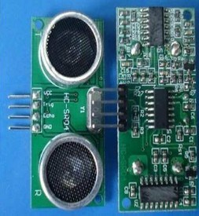
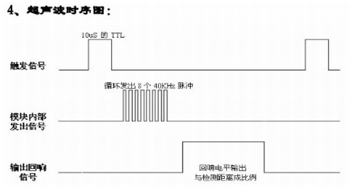

&emsp;&emsp;该模块性能稳定，测度距离精确，模块高精度，盲区小，其应用领域主要有：机器人避障、物体测距、液位检测、公共安防、停车场检测。主要技术参数如下所示：

- 使用电压：DC(5V)。
- 静态电流小于2mA。
- 电平输出：高电平为5V。
- 电平输出：低电平为0V。
- 感应角度：不大于15度。
- 探测距离：2cm至450cm
- 高精度：可达0.2cm。



&emsp;&emsp;接线方式：VCC、trig(控制端)、echo(接收端)、GND。基本工作原理如下所示：

1. 采用IO口TRIG触发测距，给至少10us的高电平信号；
2. 模块自动发送8个40KHz的方波，自动检测是否有信号返回；
3. 有信号返回，通过IO口ECHO输出一个高电平，高电平持续的时间就是超声波从发射到返回的时间，`测试距离 = (高电平时间 * 声速(340m/s))/2`。

&emsp;&emsp;本模块使用方法简单，一个控制口发一个10us以上的高电平，就可以在接收口等待高电平输出。一有输出就可以开定时器计时，当此口变为低电平时就可以读定时器的值，此时就为此次测距的时间，方可算出距离。如此不断的周期测，即可以达到移动测量的值。



&emsp;&emsp;初始化时将trig和echo端口都置低，首先向给trig发送至少10us的高电平脉冲(模块自动向外发送8个40K的方波)，然后等待，捕捉echo端输出上升沿；捕捉到上升沿的同时，打开定时器开始计时，再次等待捕捉echo的下降沿；当捕捉到下降沿，读出计时器的时间，这就是超声波在空气中运行的时间。按照公式`测试距离 = (高电平时间 * 声速(340m/s))/2`，就可以算出超声波到障碍物的距离。
&emsp;&emsp;下面是飞思卡尔XS128单片机测距的程序：

``` c
while ( 1 ) {
    PT1AD0_PT1AD00 = 1; /* 给超声波模块输入高脉冲 */
    PITINTE_PINTE1 = 1; /* 打开PIT1定时器 */

    while ( ! ( counter0 >= 4 ) ); /* 等待20us */

    PITINTE_PINTE1 = 0;
    counter0 = 0; /* 关闭定时器，计数清零 */
    PT1AD0_PT1AD00 = 0; /* trig管脚拉低 */
    PORTB_PB0 = 0; /* 指示灯0 */

    while ( ! ( PT1AD0_PT1AD01 == 1 ) ); /* 等待echo输出上升沿 */

    PORTB_PB1 = 0; /* 指示灯1 */
    PITINTE_PINTE0 = 1; /* 打开PIT0定时器 */

    while ( ! ( PT1AD0_PT1AD01 == 0 ) ); /* 等待下降沿 */

    distance = counter * 17 / 20; /* 计算距离，单位cm */
    PITINTE_PINTE0 = 0; /* 关闭定时器 */
    PORTB_PB2 = 0; /* 指示灯2 */
    PITINTE_PINTE0 = 1; /* 打开定时器定时500ms，数码管显示 */

    while ( ! ( counter >= 10000 ) ) {
        Showing ( distance ); /* 显示距离，精确1cm */
    }

    PITINTE_PINTE0 = 0;
    counter = 0; /* 关闭定时器，清零 */
}
```

---
&emsp;&emsp;下面讲解一下超声波模块的工作原理。Trig引脚相当于该模块的开关，给Trig引脚一个至少持续10us的高电平脉冲信号，该模块就开始工作了。这时该模块会自动地从这两个`大喇叭`发送8个40KHz的方波，然后自动检测是否有信号返回。如果有信号返回的话，那么该模块的Echo口就会输出一个高电平，高电平持续的时间就是超声波从发送到接收的时间。我们要做要做的就是开启超声波模块，然后再通过Echo得到超声波从发送到接收的时间。
&emsp;&emsp;怎么能准确地读到Echo的高电平呢？可以使用定时器！当开始检测高电平时，就开启定时器进行计数；当Echo变为低电平时，然后读取TH0、TL0中的值。但如果超声波回波脉宽比较长，也就是说如果高电平持续的时间长，造成了定时器溢出怎么办？这时可以开启定时器中断，进行延时等待。期间设置一个变量，用来计算等待的时间，即高电平持续的时间就是从TH0、TL0读取的数，加上定时器等待的时间，再减去以前装的初值。这种计数也不是无限长的，超声波回声脉宽最多18ms，也就是说等待18ms后就不用再等待了，这时候读出来的时间也不准了。
&emsp;&emsp;怎么把读到数计算成距离显示呢？30摄氏度时的声速V等于`331.5 + 0.6 * 温度`，23摄氏度时的声速V等于`331.5 + 0.6 * 温度`，可以使用上述公式显示成厘米。