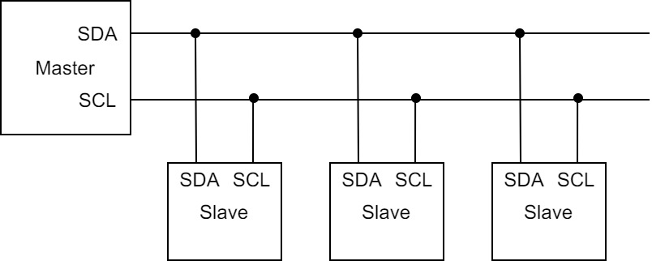

### 简介

&emsp;&emsp;`IIC`是一种串行传输总线，使用`SDA`和`SCL`这两条线即可实现数据传送：<!--more-->



### 信号

&emsp;&emsp;`IIC`协议使用的信号有`起始信号`、`终止信号`和`应答信号`：

- 起始信号和终止信号由主机产生，用于启动或停止`IIC`总线。
- 应答信号是每次传输完成一个字节数据后必须有的，用于确认传输是否完成：

1. 主机向设备发一个字节数据后，需要监听设备发出的一个应答信号，以确认设备是否收到数据。
2. 主机收一个字节数据后，需要向设备发一个应答信号，告诉设备数据是否收到数据。

&emsp;&emsp;这三种信号的产生方法如下：

- 起始信号：在`SCL`保持高电平期间，`SDA`出现由高电平向低电平变化时，启动`IIC`总线。
- 终止信号：在`SCL`保持高电平期间，`SDA`出现由低电平向高电平变化时，停止`IIC`总线。
- 应答信号：应答信号在第`9`个时钟位上出现，接收方输出低电平为应答信号$A$，输出高电平则为非应答信号$\bar{A}$。

### 数据传输

&emsp;&emsp;当`SCL`为高电平时，发送方才能将数据在`SDA`上发出，所以`SDA`上的数据必须在`SCL`为低电平的时候就要准备好。`IIC`总线首先传输的是数据最高位，最后是最低位。在第`9`个时钟脉冲的时候，发送方不再发送数据，而是将数据总线释放，由接收方发送一个应答位。
&emsp;&emsp;在起始信号后，需要向设备发送一个字节的设备地址：

1. `高7位`为设备的地址，表示同哪个设备进行通信。
2. `最低位`为数据传输方向，`1`表示读(接收)，`0`表示写(发送)。

### 具体流程

&emsp;&emsp;1. 发送(写)一个字节数据流程：

``` bash
起始信号。
发送一个设备地址，最低位为0，表示发送(写)，设备应答。
发送设备的写的基地址，设备应答。
发送数据到设备基地址，设备应答。
停止信号。
```

&emsp;&emsp;2. 接收(读)一个字节数据流程：

``` bash
起始信号。
发送一个设备地址，最低位为0，表示发送(写)，设备应答。
发送从设备要读数据的基地址，设备应答。
起始信号。
发送一个设备地址，最低位为1，表示接收(读)，设备应答。
从设备基地址处接收到一个字节的数据，主机应答。
停止信号。
```

从设备地址读或写一个字节数据后，设备读写地址会自动加`1`。
&emsp;&emsp;3. 连续发送(写)多个字节数据：

``` bash
起始信号。
发送一个设备地址，最低位为0，表示发送(写)，设备应答。
发送设备的写的基地址，设备应答。
发送数据到设备基地址，设备应答。
发送数据到设备(基地址 + 1)，设备应答。
发送数据到设备(基地址 + 2)，设备应答。
...
发送数据到设备(基地址 + n)，设备应答。
停止信号。
```

&emsp;&emsp;4. 连续接收(读)多个字节数据：

``` bash
起始信号。
发送一个设备地址，最低位为0，表示发送(写)，设备应答。
发送从设备要读数据的基地址，设备应答。
起始信号。
发送一个设备地址，最低位为1，表示接收(读)，设备应答。
从设备基地址处接收到一个字节的数据，主机应答。
从设备(基地址处 + 1)接收到一个字节的数据，主机应答。
从设备(基地址处 + 2)接收到一个字节的数据，主机应答。
...
从设备(基地址处 + n)接收到一个字节的数据，主机应答。
停止信号。
```