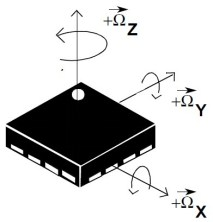

&emsp;&emsp;代码如下：<!--more-->

``` cpp
/* 参数x、y、z分别是x、y、z方向的重力加速度分量(不需要单位，直接输入数值即可)；dir是要
   获得的角度，0是与Z轴的角度，1是与X轴的角度，2是与Y轴的角度。返回值是角度值，单位是0.1° */
short MPU6050_Get_Angle ( float x, float y, float z, u8 dir ) {
    float temp;
    float res = 0;

    switch ( dir ) {
        case 0: /* 与自然Z轴的角度 */
            temp = sqrt ( ( x * x + y * y ) ) / z;
            res = atan ( temp );
            break;
        case 1: /* 与自然X轴的角度 */
            temp = x / sqrt ( ( y * y + z * z ) );
            res = atan ( temp );
            break;
        case 2: /* 与自然Y轴的角度 */
            temp = y / sqrt ( ( x * x + z * z ) );
            res = atan ( temp );
            break;
    }

    return res * 1800 / 3.14; /* 把弧度转换成角度 */
}
```

&emsp;&emsp;加速度传感器`z`轴与自然坐标系`z`轴夹角：

$$
\angle1 = \tan^{-1}(\cfrac{\sqrt{A^{2}_{x} + A^{2}_{y}}} {A_{z}})
$$

&emsp;&emsp;加速度传感器`x`轴与自然坐标系`x`轴夹角：

$$
\angle2 = \tan^{-1}(\cfrac{A_{x}} {\sqrt{A^{2}_{y} + A^{2}_{z}}})
$$

&emsp;&emsp;加速度传感器`y`轴与自然坐标系`y`轴夹角：

$$
\angle3 = \tan^{-1}(\cfrac{A_{y}} {\sqrt{A^{2}_{x} + A^{2}_{z}}})
$$

&emsp;&emsp;角速度传感器输出的是某个轴的角速度，所以如果想计算某个轴的角度(一般是相对于自然坐标轴)，那么只需要对角速度进行积分就可以了，举例来说，我们现在要测量`x`轴的角度，那么先假设起始状态`x`轴和自然坐标轴的角度为`0`，那么现在你可以将`x`轴想象成一辆只有速度仪表的汽车，汽车按照一定的速度行驶在一段时间后，如果你要计算汽车(`x`轴)到起始点的距离(`x`轴和自然周的角度)，那么你只需要用车速(`x`轴的角速度)乘以时间就可以算出来了。
&emsp;&emsp;当然，传感器的角速度输出严格来说是一个瞬时值，实际中不太可能是一个匀速值，所以需要做一些处理。

