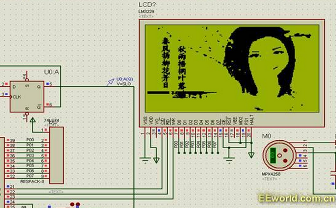
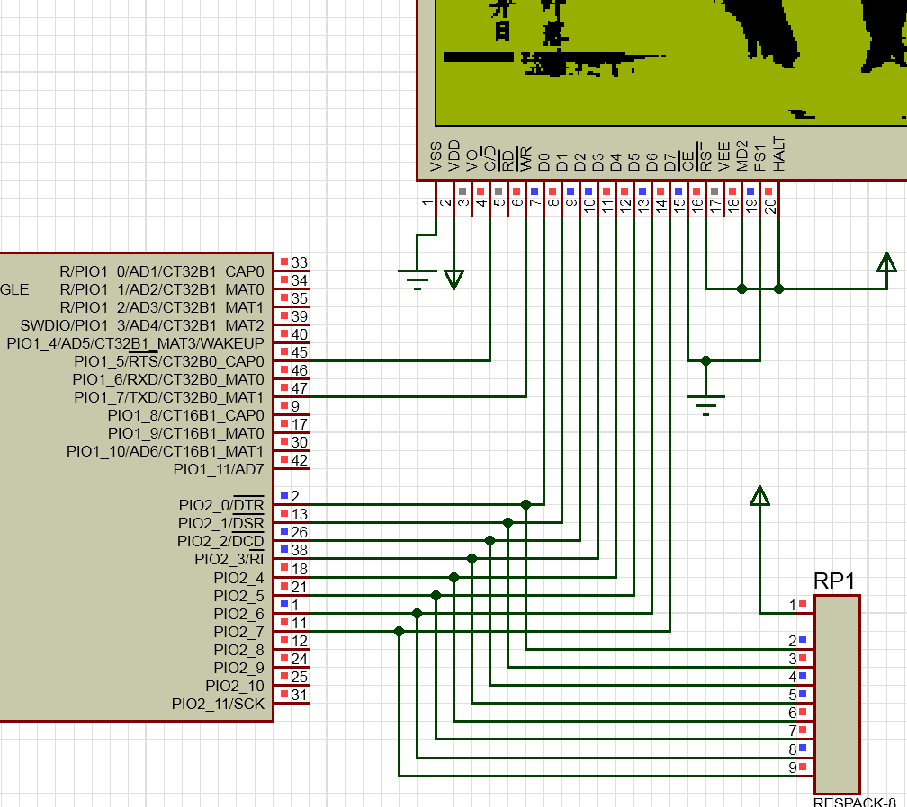

&emsp;&emsp;使用`Proteus`仿真`LM3229`(液晶驱动器为`T6963C`)，图片数据是由软件`PICtoCODE`转化的，其效果如下图：



``` cpp
#include <reg52.h>

#define uchar unsigned char
#define uint unsigned int
#define OneLine 32 /* 液晶每行的宽度 */

sbit CD = P2 ^ 0;
sbit W = P2 ^ 2;
sbit R = P2 ^ 1;

void delay_50us ( uint t ) {
    uint j;

    for ( ; t > 0; t-- )
        for ( j = 20; j > 0; j-- );
}

void WriteData ( uchar dat ) { /* 写数据 */
    CD = 0;
    W = 0;
    P0 = dat;
    W = 1;
}

void WriteCommand ( uchar com ) { /* 写命令 */
    CD = 1;
    W = 0;
    P0 = com;
    W = 1;
}

void WriteDC ( uchar dat, uchar cmd ) { /* 写一个数据和一个指令 */
    WriteData ( dat );
    WriteCommand ( cmd );
}

void WriteDDC ( uchar data1, uchar data2, uchar cmd ) { /* 写两个数据和一个指令 */
    WriteData ( data1 );
    WriteData ( data2 );
    WriteCommand ( cmd );
}

void LCD_Init ( void ) { /* 液晶初始化程序 */
    W = 1;
    WriteDDC ( 0x00, 0x00, 0x42 ); /* 设置图形显示区首地址 */
    WriteDDC ( 0x20, 0x00, 0x43 ); /* 设置图形显示区宽 */
    WriteCommand ( 0xa2 ); /* 设置光标形状 */
    WriteCommand ( 0x80 ); /* 显示方式设置(启用外部字符发生器，显示方式是图形) */
    WriteCommand ( 0x98 ); /* 启用光标闪烁(光标不显示，只是图形显示) */
}

uchar code Photo_code[] = { /* 图片宽度为240，其高度为128 */
    0x00, 0x00, 0x04, 0x00, 0x00, 0x00, 0x00, 0x00, 0x00, 0x02, 0x18, 0x00, 0x00, 0x00, 0x00, 0x00,
    0x3F, 0xFF, 0xFF, 0xFF, 0xFF, 0xFF, 0xFF, 0xF0, 0x00, 0x00, 0x00, 0x00, 0x00, 0x00,
    0x00, 0x00, 0x00, 0x00, 0x00, 0x00, 0x00, 0x00, 0x00, 0x00, 0x18, 0x00, 0x00, 0x00, 0x00, 0x00,
    0x7F, 0xFF, 0xFF, 0xFF, 0xFF, 0xFF, 0xFF, 0xF8, 0x00, 0x00, 0x00, 0x00, 0x00, 0x00,
    0x00, 0x01, 0xC0, 0x00, 0x00, 0x00, 0x00, 0x00, 0x00, 0x00, 0x18, 0x00, 0x00, 0x00, 0x00, 0x01,
    0xFF, 0xFF, 0xFF, 0xFF, 0xFF, 0xFF, 0xFF, 0xFE, 0x00, 0x00, 0x00, 0x00, 0x00, 0x00,
    0x00, 0x01, 0x00, 0x00, 0x00, 0x00, 0x00, 0x00, 0x00, 0x00, 0x18, 0x00, 0x00, 0x00, 0x00, 0x03,
    0xFF, 0xFF, 0xFF, 0xFF, 0xFF, 0xFF, 0xFF, 0xFF, 0x00, 0x00, 0x00, 0x00, 0x00, 0x00,
    0x00, 0x00, 0x00, 0x00, 0x00, 0x00, 0x00, 0x00, 0x00, 0x00, 0x00, 0x00, 0x00, 0x00, 0x00, 0x0F,
    0xFF, 0xFF, 0xFF, 0xFF, 0xFF, 0xFF, 0xFF, 0xFF, 0x80, 0x00, 0x00, 0x00, 0x00, 0x00,
    0x00, 0x00, 0x00, 0x00, 0x00, 0x00, 0x00, 0x00, 0x00, 0x00, 0x00, 0x00, 0x10, 0x00, 0x00, 0x0F,
    0xFF, 0xFF, 0xFF, 0xFF, 0xFF, 0xFF, 0xFF, 0xFF, 0xC0, 0x00, 0x00, 0x00, 0x00, 0x00,
    0x00, 0x00, 0x00, 0x00, 0x00, 0x00, 0x00, 0x00, 0x00, 0x00, 0x00, 0x00, 0x18, 0x00, 0x00, 0x1F,
    0xFF, 0xFF, 0xFF, 0xFF, 0xFF, 0xFF, 0xFF, 0xFF, 0xFF, 0xC0, 0x00, 0x00, 0x00, 0x00,
    0x00, 0x00, 0x00, 0x00, 0x00, 0x00, 0x00, 0x00, 0x00, 0x00, 0x00, 0x00, 0x30, 0x00, 0x00, 0x3F,
    0xFF, 0xFF, 0xFF, 0xFF, 0xFF, 0xFF, 0xFF, 0xFF, 0xFF, 0xC0, 0x00, 0x00, 0x00, 0x00,
    0x00, 0x00, 0x00, 0x08, 0x00, 0x00, 0x00, 0x00, 0x00, 0x00, 0x00, 0x00, 0x00, 0x00, 0x00, 0x7F,
    0xFF, 0xFF, 0xFF, 0xFF, 0xFF, 0xFF, 0xFF, 0xFF, 0xFF, 0x00, 0x00, 0x00, 0x00, 0x00,
    0x00, 0x00, 0x00, 0x1C, 0x00, 0x00, 0x00, 0x00, 0x00, 0x00, 0x00, 0x00, 0x00, 0x00, 0x00, 0xFF,
    0xFF, 0xFF, 0xFF, 0xFF, 0xFF, 0xFF, 0xFF, 0xFF, 0xFE, 0x00, 0x00, 0x00, 0x00, 0x00,
    0x00, 0x00, 0x00, 0x02, 0x00, 0x00, 0x00, 0x00, 0x00, 0x00, 0x00, 0x00, 0x00, 0x00, 0x01, 0xFF,
    0xFF, 0xFF, 0xFF, 0xFF, 0xFF, 0xFF, 0xFF, 0xFF, 0xF8, 0x00, 0x1E, 0x00, 0x00, 0x00,
    0x00, 0x00, 0x00, 0x00, 0x00, 0x00, 0x00, 0x00, 0x00, 0x00, 0x00, 0x00, 0x00, 0x00, 0x01, 0xFF,
    0xFF, 0xFF, 0xFF, 0xFF, 0xFF, 0xFF, 0xFF, 0xFF, 0xC0, 0x00, 0xFE, 0x3C, 0x04, 0x00,
    0x00, 0x00, 0x00, 0x00, 0x80, 0x00, 0x00, 0x00, 0x00, 0x00, 0x00, 0x08, 0x03, 0x80, 0x03, 0xFF,
    0xFF, 0xFF, 0xFF, 0xFF, 0xFF, 0xFF, 0xFF, 0xFF, 0xC0, 0x00, 0xFF, 0xFF, 0xFF, 0x00,
    0x00, 0x00, 0x00, 0x00, 0xC0, 0x00, 0x00, 0x00, 0x00, 0x00, 0x00, 0x00, 0x00, 0x00, 0x03, 0xFF,
    0xFF, 0xFF, 0xFF, 0xFF, 0xFF, 0xFF, 0xFF, 0xFF, 0xC0, 0x61, 0xFF, 0xFF, 0xFF, 0x00,
    0x00, 0x00, 0x00, 0x00, 0xC0, 0x00, 0x00, 0x20, 0x00, 0x00, 0x20, 0x00, 0x00, 0x40, 0x07, 0xFF,
    0xFF, 0xFF, 0xFF, 0xFF, 0xFF, 0xFF, 0xFF, 0xFF, 0xE0, 0x7E, 0xFF, 0xE0, 0xFE, 0x00,
    0x00, 0x00, 0x00, 0x00, 0x80, 0x00, 0x00, 0x00, 0x00, 0x00, 0x00, 0x00, 0x00, 0x00, 0x07, 0xFF,
    0xFF, 0xFF, 0xFF, 0xFF, 0xFE, 0x00, 0xFF, 0xFF, 0xF0, 0xE0, 0x00, 0x00, 0x7C, 0x00,
    0x00, 0x00, 0x00, 0xC0, 0x00, 0x00, 0x00, 0x00, 0x00, 0x00, 0x00, 0x00, 0x00, 0x00, 0x0F, 0xFF,
    0xFF, 0xFF, 0xFF, 0xFF, 0xF8, 0x00, 0x0F, 0xFF, 0xFF, 0xE0, 0x00, 0x00, 0x1C, 0x00,
    0x00, 0x00, 0x01, 0xF8, 0x00, 0x00, 0x00, 0x00, 0x00, 0x00, 0x00, 0x00, 0x00, 0x00, 0x1F, 0xFF,
    0xFF, 0xFF, 0xFF, 0xFF, 0xC0, 0x00, 0x03, 0xFF, 0xFF, 0xE0, 0x00, 0x00, 0x00, 0x00,
    0x00, 0x00, 0x01, 0xF0, 0x00, 0x00, 0x00, 0x00, 0x00, 0x00, 0x00, 0x00, 0x00, 0x00, 0x0F, 0xFF,
    0xFF, 0xFF, 0xFF, 0xFE, 0x00, 0x00, 0x00, 0xFF, 0xFF, 0xF0, 0x00, 0x00, 0x00, 0x00,
    0x00, 0x00, 0x01, 0xF8, 0x00, 0x00, 0x00, 0x00, 0x00, 0x00, 0x00, 0x00, 0x00, 0x00, 0x06, 0xFF,
    0xFF, 0xFF, 0xFF, 0xF0, 0x00, 0x00, 0x00, 0x3F, 0xFF, 0xF0, 0x00, 0x00, 0x00, 0x00,
    0x00, 0x00, 0x01, 0xFC, 0x00, 0x0E, 0x00, 0x00, 0x00, 0x00, 0x00, 0x00, 0x10, 0x00, 0x40, 0x7F,
    0xFF, 0xFF, 0xFF, 0xE0, 0x00, 0x00, 0x00, 0x0F, 0xFF, 0xF0, 0x00, 0x00, 0x00, 0x00,
    0x00, 0x00, 0x07, 0xF0, 0x00, 0x04, 0x00, 0x00, 0x00, 0x00, 0x10, 0x00, 0x18, 0x00, 0x60, 0xFF,
    0xFF, 0xFF, 0xFF, 0xC0, 0x00, 0x00, 0x00, 0x0F, 0xFF, 0xF8, 0x00, 0x00, 0x00, 0x00,
    0x00, 0x00, 0x01, 0xF8, 0x00, 0x00, 0x00, 0x00, 0x00, 0x00, 0x30, 0x00, 0x0C, 0x00, 0x00, 0x3F,
    0xFF, 0xFF, 0xFE, 0x00, 0x00, 0x00, 0x00, 0x03, 0xFF, 0xFC, 0x00, 0x00, 0x00, 0x00,
    0x00, 0x00, 0x03, 0xFE, 0x00, 0x00, 0x00, 0x00, 0x00, 0x00, 0x00, 0x00, 0x00, 0x00, 0x3C, 0x3F,
    0xFF, 0xFF, 0xF8, 0x00, 0x00, 0x00, 0x00, 0x03, 0xFF, 0xFC, 0x00, 0x00, 0x00, 0x00,
    0x00, 0x00, 0x07, 0xF7, 0x00, 0x00, 0x00, 0x00, 0x00, 0x00, 0x00, 0x00, 0x00, 0x00, 0x3C, 0x3F,
    0xFF, 0xFF, 0xF8, 0x00, 0x00, 0x00, 0x00, 0x01, 0xFF, 0xFC, 0x00, 0x00, 0x00, 0x00,
    0x00, 0x00, 0x0D, 0xF0, 0x00, 0x00, 0x00, 0x00, 0x00, 0x00, 0x00, 0x00, 0x00, 0x00, 0x7E, 0x7F,
    0xFF, 0xFF, 0xF0, 0x00, 0x00, 0x00, 0x00, 0x00, 0xFF, 0xFC, 0x00, 0x00, 0x00, 0x00,
    0x00, 0x00, 0x01, 0xF0, 0x00, 0x00, 0x00, 0x00, 0x00, 0x00, 0x00, 0x00, 0x00, 0x00, 0x7F, 0xFF,
    0xFF, 0xFF, 0xE0, 0x00, 0x00, 0x00, 0x00, 0x00, 0x7F, 0xFE, 0x00, 0x00, 0x00, 0x00,
    0x00, 0x00, 0x00, 0x10, 0x00, 0x00, 0x00, 0x00, 0x00, 0x00, 0x00, 0x00, 0x00, 0x00, 0x7F, 0xFF,
    0xFF, 0xFF, 0xE0, 0x00, 0x00, 0x00, 0x00, 0x00, 0x3F, 0xFE, 0x00, 0x00, 0x00, 0x00,
    0x00, 0x00, 0x00, 0x18, 0x00, 0x00, 0x00, 0x00, 0x00, 0x00, 0x00, 0x00, 0x00, 0x00, 0xFF, 0xFF,
    0xFF, 0xFF, 0xE0, 0x00, 0x00, 0x00, 0x00, 0x00, 0x3F, 0xFE, 0x00, 0x00, 0x00, 0x00,
    0x00, 0x00, 0x03, 0xFC, 0x00, 0x00, 0x20, 0x00, 0x00, 0x00, 0x00, 0x00, 0x00, 0x30, 0xE1, 0xFF,
    0xFF, 0xFF, 0xC0, 0x00, 0x00, 0x00, 0x00, 0x00, 0x1F, 0xFF, 0x00, 0x00, 0x00, 0x00,
    0x00, 0x00, 0x03, 0xF8, 0x00, 0x03, 0xB0, 0x00, 0x00, 0x00, 0x00, 0x00, 0x00, 0x38, 0xC1, 0xFF,
    0xFF, 0xFF, 0xC0, 0x00, 0x00, 0x00, 0x00, 0x00, 0x1F, 0xFF, 0x00, 0x00, 0x00, 0x00,
    0x00, 0x00, 0x03, 0xB8, 0x00, 0x07, 0x30, 0x20, 0x00, 0x30, 0x01, 0x00, 0x00, 0x11, 0xFC, 0xFF,
    0xFF, 0xFF, 0xC0, 0x00, 0x00, 0x00, 0x00, 0x38, 0x1F, 0xFF, 0x00, 0x00, 0x00, 0x00,
    0x00, 0x00, 0x03, 0xF8, 0x00, 0x03, 0x3C, 0x06, 0x00, 0x00, 0x01, 0xC0, 0x00, 0x01, 0xFE, 0xFF,
    0xFF, 0xFF, 0x80, 0x00, 0x00, 0x00, 0x03, 0xC0, 0x0F, 0xFF, 0x00, 0x00, 0x00, 0x00,
    0x00, 0x00, 0x03, 0xF8, 0x00, 0x1F, 0xF8, 0x07, 0x00, 0x00, 0x00, 0xC0, 0x00, 0x03, 0xFF, 0xFF,
    0xFF, 0xFF, 0x80, 0x00, 0x00, 0x00, 0x1F, 0x00, 0x0F, 0xFF, 0x00, 0x00, 0x00, 0x00,
    0x00, 0x00, 0x03, 0x78, 0x00, 0x1F, 0xE0, 0x00, 0x00, 0x00, 0x00, 0x00, 0x00, 0x03, 0xFF, 0xFF,
    0xFF, 0xFF, 0x80, 0x00, 0x00, 0x00, 0x7C, 0x00, 0x07, 0xFF, 0x80, 0x00, 0x00, 0x00,
    0x00, 0x00, 0x03, 0xFD, 0x00, 0x07, 0xF0, 0x00, 0x00, 0x00, 0x00, 0x00, 0x00, 0x03, 0xFF, 0xFF,
    0xFF, 0xFF, 0x00, 0x00, 0x00, 0x00, 0x70, 0x00, 0x07, 0xFF, 0x80, 0x00, 0x00, 0x00,
    0x00, 0x00, 0x07, 0x9F, 0x00, 0x0F, 0x70, 0x00, 0x00, 0x00, 0x01, 0xC0, 0x00, 0x03, 0xFF, 0xFF,
    0xFF, 0xFF, 0x00, 0x00, 0x00, 0x00, 0x00, 0x00, 0x03, 0xFF, 0x80, 0x00, 0x00, 0x00,
    0x00, 0x00, 0x0C, 0x07, 0x00, 0x1B, 0xDC, 0x00, 0x08, 0x00, 0x00, 0xC0, 0x00, 0x03, 0xFF, 0xFF,
    0xFB, 0xFF, 0x00, 0x00, 0x00, 0x00, 0x03, 0xFE, 0x03, 0xFF, 0x80, 0x00, 0x00, 0x00,
    0x00, 0x00, 0x09, 0x83, 0x00, 0x03, 0x8E, 0x00, 0x07, 0x00, 0x00, 0x00, 0x00, 0x07, 0xFF, 0xFF,
    0xFF, 0xFF, 0x0F, 0xFC, 0x00, 0x00, 0x0F, 0xFF, 0x83, 0xFF, 0x80, 0x00, 0x00, 0x00,
    0x00, 0x00, 0x01, 0x9C, 0x00, 0x02, 0x04, 0x00, 0x00, 0x00, 0x00, 0x00, 0x00, 0x03, 0xFF, 0xFF,
    0xFF, 0xFF, 0x80, 0x00, 0x00, 0x00, 0x1F, 0xEF, 0x83, 0xFF, 0x80, 0x00, 0x00, 0x00,
    0x00, 0x00, 0x01, 0xFC, 0x00, 0x00, 0x30, 0x00, 0x00, 0x00, 0x00, 0x00, 0x00, 0x03, 0xFF, 0xFF,
    0xFF, 0xFF, 0x00, 0x00, 0x00, 0x00, 0x3F, 0xC6, 0x01, 0xFF, 0x80, 0x00, 0x00, 0x00,
    0x00, 0x00, 0x03, 0xD8, 0x00, 0x03, 0xF8, 0x00, 0x00, 0x00, 0x00, 0x00, 0x00, 0x03, 0xFF, 0xFF,
    0xFF, 0xFF, 0x00, 0x60, 0x00, 0x00, 0x07, 0xC0, 0x01, 0xFF, 0x80, 0x00, 0x00, 0x00,
    0x00, 0x00, 0x07, 0xBE, 0x00, 0x07, 0xC0, 0x00, 0x00, 0x01, 0xC0, 0x00, 0x00, 0x03, 0xFF, 0xFF,
    0xFF, 0xFF, 0x0F, 0xFC, 0x00, 0x00, 0x00, 0x00, 0x01, 0xFF, 0x80, 0x00, 0x00, 0x00,
    0x00, 0x00, 0x01, 0xFF, 0x00, 0x00, 0xFC, 0x00, 0x00, 0x00, 0xF0, 0x00, 0x00, 0x03, 0xFF, 0xFF,
    0xFF, 0xFE, 0x3F, 0xFC, 0x00, 0x00, 0x00, 0x00, 0x01, 0xFF, 0x80, 0x00, 0x00, 0x00,
    0x00, 0x00, 0x07, 0xBE, 0x00, 0x0F, 0xFC, 0x00, 0x00, 0x00, 0x70, 0x00, 0x00, 0x03, 0xFF, 0xFF,
    0xFF, 0xFE, 0x7F, 0xF9, 0x80, 0x00, 0x00, 0x00, 0x00, 0xFF, 0x80, 0x00, 0x00, 0x00,
    0x00, 0x00, 0x0F, 0xFE, 0x00, 0x0F, 0xFC, 0x00, 0x00, 0x00, 0x00, 0x00, 0x00, 0x03, 0xFF, 0xFF,
    0xFF, 0xFF, 0x7C, 0xF9, 0x80, 0x00, 0x00, 0x00, 0x00, 0xFF, 0x80, 0x00, 0x00, 0x00,
    0x00, 0x00, 0x01, 0xF6, 0x00, 0x0F, 0xEC, 0x00, 0x00, 0x00, 0x00, 0x00, 0x00, 0x07, 0xFF, 0xFF,
    0xFF, 0xFF, 0xF8, 0x60, 0x00, 0x00, 0x00, 0x00, 0x00, 0xFF, 0x80, 0x00, 0x00, 0x00,
    0x00, 0x00, 0x03, 0xEE, 0x00, 0x0F, 0xFC, 0x00, 0x00, 0x00, 0x00, 0xE0, 0x00, 0x07, 0xFF, 0xFF,
    0xFF, 0xFE, 0x00, 0x00, 0x00, 0x00, 0x00, 0x00, 0x00, 0xFF, 0x80, 0x00, 0x00, 0x00,
    0x00, 0x00, 0x01, 0x4C, 0x00, 0x0C, 0x9C, 0x00, 0x00, 0x00, 0x00, 0x04, 0x00, 0x07, 0xFF, 0xFF,
    0xFF, 0xFE, 0x00, 0x00, 0x00, 0x00, 0x00, 0x00, 0x00, 0xFF, 0x80, 0x00, 0x00, 0x00,
    0x00, 0x00, 0x00, 0x00, 0x00, 0x0C, 0x98, 0x00, 0x00, 0x00, 0x00, 0x00, 0x00, 0x07, 0xFF, 0xFF,
    0xFF, 0xFE, 0x00, 0x00, 0x00, 0x00, 0x00, 0x00, 0x00, 0xFF, 0xC0, 0x00, 0x00, 0x00,
    0x00, 0x00, 0x01, 0x80, 0x00, 0x00, 0x18, 0x00, 0x00, 0x00, 0x00, 0x00, 0x00, 0x07, 0xFF, 0xFF,
    0xFF, 0xFE, 0x00, 0x00, 0x00, 0x00, 0x00, 0x00, 0x00, 0xFF, 0xC0, 0x00, 0x00, 0x00,
    0x00, 0x00, 0x01, 0x90, 0x00, 0x06, 0x00, 0x00, 0x00, 0x00, 0x00, 0x00, 0x40, 0x0F, 0xFF, 0xFF,
    0xFF, 0xFE, 0x00, 0x00, 0x00, 0x00, 0x00, 0x00, 0x00, 0xFF, 0xC0, 0x00, 0x00, 0x00,
    0x00, 0x00, 0x01, 0xB2, 0x00, 0x06, 0x78, 0x00, 0x00, 0x00, 0x00, 0x00, 0x40, 0x0F, 0xFE, 0x3F,
    0xFF, 0xFE, 0x00, 0x00, 0x00, 0x00, 0x00, 0x00, 0x00, 0xFF, 0xC0, 0x00, 0x00, 0x00,
    0x00, 0x00, 0x03, 0xFF, 0x00, 0x06, 0xF0, 0x00, 0x00, 0x00, 0x00, 0x00, 0x08, 0x0F, 0xFF, 0x7F,
    0xFF, 0xFE, 0x00, 0x00, 0x00, 0x00, 0x00, 0x00, 0x00, 0xFF, 0xC0, 0x00, 0x00, 0x00,
    0x00, 0x00, 0x07, 0xFF, 0x00, 0x0F, 0xF8, 0x00, 0x00, 0x00, 0x00, 0x00, 0x0E, 0x0F, 0xFF, 0xFF,
    0xFF, 0xFE, 0x00, 0x00, 0x00, 0x00, 0x00, 0x00, 0x01, 0xFF, 0x80, 0x00, 0x00, 0x00,
    0x00, 0x00, 0x03, 0xFF, 0x00, 0x1F, 0xF8, 0x00, 0x00, 0x00, 0x00, 0x00, 0x07, 0x0E, 0xFF, 0xFF,
    0xFF, 0xFE, 0x00, 0x00, 0x00, 0x00, 0x00, 0x00, 0x01, 0xFF, 0x80, 0x00, 0x00, 0x00,
    0x00, 0x00, 0x03, 0xFF, 0x00, 0x07, 0xFE, 0x00, 0x00, 0x00, 0x00, 0x00, 0x01, 0x19, 0xFF, 0xFF,
    0xFF, 0xFF, 0x00, 0x00, 0x00, 0x00, 0x00, 0x00, 0x01, 0xFF, 0x80, 0x00, 0x00, 0x00,
    0x00, 0x00, 0x07, 0xFE, 0x00, 0x0F, 0xF8, 0x00, 0x00, 0x00, 0x00, 0x00, 0x00, 0x39, 0xFF, 0xFF,
    0xFF, 0xFF, 0x00, 0x00, 0x00, 0x00, 0x00, 0x00, 0x03, 0xFF, 0x80, 0x00, 0x00, 0x00,
    0x00, 0x00, 0x0D, 0xEC, 0x00, 0x1E, 0xFC, 0x00, 0x00, 0x00, 0x00, 0x00, 0x00, 0x1F, 0xFF, 0xFF,
    0xFF, 0xFF, 0x00, 0x00, 0x00, 0x00, 0x00, 0x00, 0x03, 0xFF, 0x80, 0x00, 0x00, 0x00,
    0x00, 0x00, 0x01, 0x4C, 0x00, 0x16, 0xD8, 0x00, 0x00, 0x00, 0x00, 0x00, 0x00, 0x0F, 0xFF, 0xFF,
    0xFF, 0xFF, 0x00, 0x00, 0x00, 0x00, 0x00, 0x00, 0x07, 0xFF, 0x80, 0x00, 0x00, 0x00,
    0x00, 0x00, 0x00, 0x0C, 0x00, 0x06, 0xF8, 0x00, 0x00, 0x00, 0x00, 0x00, 0x00, 0x09, 0xFB, 0xFF,
    0xFF, 0xFF, 0x00, 0x00, 0x00, 0x00, 0x00, 0x00, 0x0F, 0xFF, 0x80, 0x00, 0x00, 0x00,
    0x00, 0x00, 0x00, 0x08, 0x00, 0x02, 0x40, 0x00, 0x00, 0x00, 0x00, 0x00, 0x00, 0x00, 0xE1, 0xFF,
    0xFF, 0xFF, 0x00, 0x00, 0x00, 0x00, 0x01, 0x80, 0x0F, 0xFF, 0x00, 0x00, 0x00, 0x00,
    0x00, 0x00, 0x01, 0x98, 0x00, 0x06, 0x00, 0x00, 0x00, 0x00, 0x00, 0x00, 0x00, 0x00, 0xEF, 0xFF,
    0xFF, 0xFF, 0x80, 0x00, 0x00, 0x00, 0x07, 0x00, 0x1F, 0xFF, 0x00, 0x00, 0x00, 0x00,
    0x00, 0x00, 0x01, 0x9C, 0x00, 0x06, 0x00, 0x00, 0x00, 0x00, 0x00, 0x00, 0x00, 0x00, 0xFF, 0xFF,
    0xFF, 0xFF, 0x80, 0x00, 0x00, 0x00, 0x1C, 0x00, 0x3F, 0xFF, 0x00, 0x00, 0x00, 0x00,
    0x00, 0x00, 0x07, 0xFE, 0x00, 0x06, 0xFC, 0x00, 0x00, 0x00, 0x00, 0x00, 0x00, 0x00, 0x7F, 0xFF,
    0xFF, 0xFF, 0x80, 0x00, 0x00, 0x00, 0x30, 0x00, 0x7F, 0xFF, 0x00, 0x00, 0x00, 0x00,
    0x00, 0x00, 0x03, 0xB0, 0x00, 0x07, 0xFC, 0x00, 0x00, 0x00, 0x00, 0x00, 0x00, 0x00, 0x7F, 0xFF,
    0x8F, 0xFF, 0x80, 0x00, 0x00, 0x00, 0x00, 0x00, 0xFF, 0xFF, 0x00, 0x00, 0x00, 0x00,
    0x00, 0x00, 0x01, 0xAC, 0x00, 0x1F, 0xFC, 0x00, 0x00, 0x00, 0x00, 0x00, 0x00, 0x00, 0x3F, 0x3F,
    0x8F, 0xFF, 0xC0, 0x00, 0x00, 0x00, 0x00, 0x01, 0xFF, 0xFE, 0x00, 0x00, 0x00, 0x00,
    0x00, 0x00, 0x01, 0xBC, 0x00, 0x06, 0xF4, 0x00, 0x00, 0x00, 0x00, 0x00, 0x00, 0x00, 0x3F, 0x7F,
    0xFF, 0xFF, 0xC0, 0x00, 0x00, 0x00, 0x00, 0x03, 0xFF, 0xFE, 0x00, 0x00, 0x00, 0x00,
    0x00, 0x00, 0x03, 0x38, 0x00, 0x0F, 0xFC, 0x00, 0x00, 0x00, 0x00, 0x00, 0x00, 0x00, 0x1F, 0xFF,
    0xFF, 0xFF, 0xE0, 0x00, 0x00, 0x00, 0x00, 0x03, 0xFF, 0xFE, 0x00, 0x00, 0x00, 0x00,
    0x00, 0x00, 0x07, 0x71, 0x00, 0x1E, 0xF4, 0x00, 0x00, 0x00, 0x00, 0x00, 0x00, 0x00, 0x1B, 0xFF,
    0xFF, 0xFF, 0xE0, 0x00, 0x00, 0x00, 0x00, 0x07, 0xFF, 0xFE, 0x00, 0x00, 0x00, 0x00,
    0x00, 0x00, 0x0D, 0xE3, 0x00, 0x17, 0xCC, 0x00, 0x00, 0x00, 0x00, 0x00, 0x00, 0x00, 0x1F, 0xFF,
    0xFF, 0xDF, 0xE0, 0x00, 0x00, 0x00, 0x00, 0x0F, 0xFF, 0xFC, 0x00, 0x00, 0x00, 0x00,
    0x00, 0x00, 0x01, 0x3F, 0x00, 0x06, 0x8C, 0x00, 0x00, 0x00, 0x00, 0x00, 0x00, 0x00, 0x0F, 0xFF,
    0xFF, 0xFF, 0xE0, 0x00, 0x00, 0x00, 0x00, 0x1F, 0xFF, 0xFC, 0x00, 0x00, 0x00, 0x00,
    0x00, 0x00, 0x01, 0x1F, 0x00, 0x06, 0x0C, 0x00, 0x00, 0x00, 0x00, 0x00, 0x00, 0x00, 0x06, 0xFF,
    0xFF, 0xFF, 0xE0, 0x00, 0x00, 0x00, 0x00, 0x3F, 0xFF, 0xFC, 0x00, 0x00, 0x00, 0x00,
    0x00, 0x00, 0x01, 0x08, 0x00, 0x00, 0x60, 0x00, 0x00, 0x00, 0x00, 0x00, 0x00, 0x00, 0x07, 0xFF,
    0xFF, 0xFF, 0xF0, 0x00, 0x00, 0x00, 0x00, 0x7F, 0xFF, 0xFC, 0x00, 0x00, 0x00, 0x00,
    0x00, 0x00, 0x01, 0xF8, 0x00, 0x00, 0x60, 0x00, 0x00, 0x00, 0x00, 0x00, 0x00, 0x00, 0x03, 0xFF,
    0xFF, 0xFF, 0xF0, 0x00, 0x00, 0x00, 0x00, 0xFF, 0xFF, 0xFC, 0x00, 0x00, 0x00, 0x00,
    0x00, 0x00, 0x03, 0xF0, 0x00, 0x00, 0x60, 0x00, 0x00, 0x00, 0x00, 0x00, 0x00, 0x00, 0x01, 0xBF,
    0xFF, 0xFF, 0xF0, 0x00, 0x00, 0x00, 0x00, 0xFF, 0xFF, 0xFC, 0x00, 0x00, 0x00, 0x00,
    0x00, 0x00, 0x00, 0xF4, 0x00, 0x1F, 0x7C, 0x00, 0x00, 0x00, 0x00, 0x00, 0x00, 0x00, 0x01, 0x1F,
    0xFF, 0xFF, 0xF8, 0x00, 0x00, 0x00, 0x00, 0xFF, 0xFF, 0xFC, 0x00, 0x00, 0x00, 0x00,
    0x00, 0x00, 0x01, 0xFF, 0x00, 0x1F, 0xFC, 0x00, 0x00, 0x00, 0x00, 0x00, 0x00, 0x00, 0x00, 0x3F,
    0xFF, 0xFF, 0xF8, 0x00, 0x00, 0x00, 0x00, 0xFF, 0xFF, 0xF8, 0x00, 0x00, 0x00, 0x00,
    0x00, 0x00, 0x0F, 0xF8, 0x00, 0x0E, 0x60, 0x00, 0x00, 0x00, 0x00, 0x00, 0x00, 0x00, 0x00, 0x0F,
    0xFF, 0xFF, 0xF8, 0x00, 0x00, 0x00, 0x00, 0x7F, 0xFF, 0xF8, 0x00, 0x00, 0x00, 0x00,
    0x00, 0x00, 0x00, 0xB0, 0x00, 0x0E, 0x60, 0x00, 0x00, 0x00, 0x00, 0x00, 0x00, 0x00, 0x00, 0x0F,
    0xFF, 0xFF, 0xFC, 0x00, 0x00, 0x00, 0x00, 0x7F, 0xFF, 0xF8, 0x00, 0x00, 0x00, 0x00,
    0x00, 0x00, 0x01, 0xB0, 0x00, 0x08, 0x60, 0x00, 0x00, 0x00, 0x00, 0x00, 0x00, 0x00, 0x00, 0x0F,
    0xFF, 0xFF, 0xFC, 0x00, 0x00, 0x00, 0x00, 0x7F, 0xFF, 0xF8, 0x00, 0x00, 0x00, 0x00,
    0x00, 0x00, 0x01, 0xB0, 0x00, 0x00, 0x60, 0x00, 0x00, 0x00, 0x00, 0x00, 0x00, 0x00, 0x00, 0x03,
    0xFF, 0xFF, 0xFC, 0x00, 0x00, 0x00, 0x00, 0x7F, 0xFF, 0xF8, 0x00, 0x00, 0x00, 0x00,
    0x00, 0x00, 0x03, 0x30, 0x00, 0x00, 0x60, 0x00, 0x00, 0x00, 0x00, 0x00, 0x00, 0x00, 0x00, 0x01,
    0xFF, 0xFF, 0xFE, 0x00, 0x00, 0x00, 0x00, 0x7F, 0xFF, 0xF0, 0x00, 0x00, 0x00, 0x00,
    0x00, 0x00, 0x04, 0x30, 0x00, 0x00, 0x20, 0x00, 0x00, 0x00, 0x00, 0x00, 0x00, 0x00, 0x00, 0x00,
    0x7F, 0xFF, 0xFE, 0x00, 0x00, 0x00, 0x00, 0x7F, 0xFF, 0xF0, 0x00, 0x00, 0x00, 0x00,
    0x00, 0x00, 0x00, 0x00, 0x00, 0x00, 0x20, 0x00, 0x00, 0x00, 0x00, 0x00, 0x00, 0x00, 0x00, 0x00,
    0x7F, 0xFF, 0xFE, 0x00, 0x00, 0x00, 0x00, 0x7F, 0xFF, 0xF0, 0x00, 0x00, 0x00, 0x00,
    0x00, 0x00, 0x00, 0x78, 0x00, 0x02, 0x60, 0x00, 0x00, 0x00, 0x00, 0x00, 0x00, 0x00, 0x00, 0x00,
    0x3F, 0xFF, 0xFF, 0x00, 0x00, 0x00, 0x00, 0x3F, 0xFF, 0xF0, 0x00, 0x00, 0x00, 0x00,
    0x00, 0x00, 0x01, 0xF8, 0x00, 0x03, 0xF8, 0x00, 0x00, 0x00, 0x00, 0x00, 0x00, 0x00, 0x00, 0x00,
    0x1F, 0xFF, 0xFF, 0x00, 0x00, 0x00, 0x00, 0x3F, 0xFF, 0xE0, 0x00, 0x00, 0x00, 0x00,
    0x00, 0x00, 0x01, 0x98, 0x00, 0x0F, 0xF8, 0x00, 0x00, 0x00, 0x00, 0x00, 0x00, 0x00, 0x00, 0x00,
    0x1F, 0xFF, 0xFF, 0x80, 0x00, 0x00, 0x00, 0x3F, 0xFF, 0xE0, 0x00, 0x00, 0x00, 0x00,
    0x00, 0x00, 0x01, 0xF8, 0x00, 0x07, 0xF0, 0x00, 0x00, 0x00, 0x00, 0x00, 0x00, 0x00, 0x00, 0x00,
    0x0F, 0xFF, 0xFF, 0x80, 0x00, 0x00, 0x00, 0x3F, 0xFF, 0xC0, 0x00, 0x00, 0x00, 0x00,
    0x00, 0x00, 0x01, 0xF8, 0x00, 0x07, 0xF0, 0x00, 0x00, 0x00, 0x00, 0x00, 0x00, 0x00, 0x00, 0x00,
    0x0F, 0xFF, 0xFF, 0xC0, 0x00, 0x00, 0x00, 0x1F, 0xFF, 0xC0, 0x00, 0x00, 0x00, 0x00,
    0x00, 0x00, 0x01, 0x98, 0x00, 0x0F, 0xE0, 0x00, 0x00, 0x00, 0x00, 0x00, 0x00, 0x00, 0x00, 0x00,
    0x0F, 0xFF, 0xFF, 0xC0, 0x00, 0x00, 0x00, 0x0F, 0xFF, 0xC0, 0x00, 0x00, 0x00, 0x00,
    0x00, 0x00, 0x01, 0xF8, 0x00, 0x07, 0xF0, 0x00, 0x00, 0x00, 0x00, 0x00, 0x00, 0x00, 0x00, 0x00,
    0x07, 0xFF, 0xFF, 0xC0, 0x00, 0x00, 0x00, 0x0F, 0xFF, 0xC0, 0x00, 0x00, 0x00, 0x00,
    0x00, 0x00, 0x01, 0xF8, 0x00, 0x07, 0xBE, 0x00, 0x00, 0x00, 0x00, 0x00, 0x00, 0x00, 0x00, 0x00,
    0x07, 0xFF, 0xFF, 0xE0, 0x00, 0x00, 0x00, 0x07, 0xFF, 0xF0, 0x00, 0x00, 0x00, 0x00,
    0x00, 0x00, 0x01, 0x18, 0x00, 0x07, 0xFE, 0x00, 0x00, 0x00, 0x00, 0x00, 0x00, 0x00, 0x00, 0x00,
    0x03, 0xFF, 0xFF, 0xE0, 0x00, 0x00, 0x00, 0x07, 0xFF, 0xC0, 0x00, 0x00, 0x00, 0x00,
    0x00, 0x00, 0x00, 0x00, 0x00, 0x0D, 0xF0, 0x00, 0x00, 0x00, 0x00, 0x00, 0x00, 0x00, 0x00, 0x00,
    0x03, 0xDF, 0xFF, 0xF0, 0x00, 0x00, 0x00, 0x0F, 0xFF, 0xC0, 0x00, 0x00, 0x00, 0x00,
    0x00, 0x00, 0x00, 0x00, 0x00, 0x0D, 0xF0, 0x00, 0x00, 0x00, 0x00, 0x00, 0x00, 0x00, 0x00, 0x00,
    0x03, 0xDF, 0xFF, 0xF0, 0x00, 0x00, 0x00, 0x0F, 0xFF, 0xE0, 0x00, 0x00, 0x00, 0x00,
    0x00, 0x00, 0x00, 0x00, 0x00, 0x00, 0x00, 0x00, 0x00, 0x00, 0x00, 0x00, 0x00, 0x00, 0x00, 0x00,
    0x03, 0xCF, 0xFF, 0xF0, 0x00, 0x00, 0x00, 0x0F, 0xFF, 0xF8, 0x00, 0x00, 0x00, 0x00,
    0x00, 0x00, 0x00, 0x00, 0x00, 0x00, 0x30, 0x00, 0x00, 0x00, 0x00, 0x00, 0x00, 0x00, 0x00, 0x00,
    0x03, 0xCF, 0xFF, 0xF0, 0x00, 0x00, 0x00, 0x0F, 0xFF, 0xF8, 0x00, 0x00, 0x00, 0x00,
    0x00, 0x00, 0x00, 0x00, 0x00, 0x00, 0x30, 0x00, 0x00, 0x00, 0x00, 0x00, 0x00, 0x00, 0x00, 0x00,
    0x03, 0xCF, 0xFF, 0xF0, 0x00, 0x00, 0x00, 0x1F, 0xFF, 0xF8, 0x00, 0x00, 0x00, 0x00,
    0xFF, 0xFF, 0xFF, 0xFE, 0x3C, 0xFF, 0xFF, 0xFF, 0xFF, 0xFF, 0x00, 0x00, 0x00, 0x00, 0x00, 0x00,
    0x01, 0xCF, 0xFF, 0xF8, 0x00, 0x00, 0x00, 0x1F, 0xFF, 0xE3, 0x00, 0x00, 0x00, 0x00,
    0xFF, 0xFF, 0xFF, 0xFE, 0x1D, 0xFF, 0xFF, 0xFF, 0xFF, 0xFF, 0xFF, 0xFE, 0xC0, 0x00, 0x00, 0x00,
    0x03, 0xC6, 0x7F, 0xF8, 0x00, 0x00, 0x00, 0x1F, 0xFB, 0xE3, 0x00, 0x00, 0x00, 0x00,
    0xFF, 0xFF, 0xFF, 0xFE, 0x18, 0xDF, 0xFF, 0xFF, 0xFF, 0xFF, 0xFF, 0x80, 0x00, 0x00, 0x00, 0x00,
    0x01, 0x04, 0x7F, 0xF0, 0x00, 0x00, 0x00, 0x1F, 0xF9, 0xE0, 0x30, 0x00, 0x00, 0x00,
    0xFF, 0xFF, 0xFF, 0xFE, 0x3F, 0xFF, 0xFF, 0xFF, 0xFF, 0xFF, 0xF0, 0x00, 0x00, 0x00, 0x00, 0x00,
    0x00, 0x00, 0x7F, 0xE0, 0x00, 0x00, 0x00, 0x3F, 0xFF, 0xE0, 0x00, 0x00, 0x00, 0x00,
    0x00, 0x00, 0x00, 0x00, 0x18, 0xBF, 0xFC, 0x3F, 0xFE, 0xFC, 0x00, 0x00, 0x00, 0x00, 0x00, 0x00,
    0x00, 0x00, 0x3F, 0xC0, 0x00, 0x00, 0x00, 0x3F, 0xC1, 0xF0, 0x00, 0x00, 0x00, 0x00,
    0x00, 0x00, 0x00, 0x00, 0x00, 0x5F, 0xFC, 0x18, 0xF8, 0x30, 0x00, 0x00, 0x00, 0x00, 0x00, 0x00,
    0x00, 0x00, 0x07, 0xC0, 0x00, 0x00, 0x00, 0x7F, 0x80, 0x78, 0x00, 0x00, 0x00, 0x00,
    0x00, 0x00, 0x00, 0x00, 0x03, 0xFF, 0xFE, 0x18, 0x18, 0x30, 0x00, 0x00, 0x00, 0x00, 0x00, 0x00,
    0x00, 0x00, 0x03, 0xE0, 0x00, 0x00, 0x00, 0xFE, 0x00, 0x00, 0x00, 0x00, 0x00, 0x00,
    0x00, 0x00, 0x00, 0x00, 0x01, 0x6F, 0xFC, 0x38, 0x00, 0x38, 0x10, 0x00, 0x00, 0x00, 0x00, 0x00,
    0x00, 0x00, 0x00, 0x00, 0x00, 0x00, 0x00, 0xF8, 0x00, 0x00, 0x00, 0x00, 0x00, 0x00,
    0x00, 0x00, 0x00, 0x00, 0x0F, 0x7F, 0xFC, 0x10, 0xC0, 0x38, 0x10, 0x00, 0x00, 0x00, 0x00, 0x00,
    0x00, 0x00, 0x00, 0x00, 0x00, 0x00, 0x00, 0xF0, 0x00, 0x06, 0x00, 0x00, 0x00, 0x00,
    0x00, 0x00, 0x00, 0x00, 0x0F, 0xFF, 0xFD, 0x91, 0xF8, 0x38, 0x00, 0x00, 0x00, 0x00, 0x00, 0x00,
    0x00, 0x00, 0x00, 0x00, 0x00, 0x00, 0x00, 0x00, 0x00, 0x01, 0x00, 0x00, 0x00, 0x00,
    0x00, 0x00, 0x00, 0x00, 0x00, 0x01, 0xE0, 0x00, 0x18, 0x18, 0x00, 0x00, 0x00, 0x00, 0x00, 0x00,
    0x00, 0x00, 0x00, 0x00, 0x00, 0x00, 0x00, 0x00, 0x00, 0x00, 0x00, 0x00, 0x00, 0x00,
    0x00, 0x00, 0x00, 0x00, 0x00, 0x00, 0x00, 0x00, 0x00, 0x00, 0x00, 0x00, 0x00, 0x00, 0x00, 0x00,
    0x00, 0x00, 0x00, 0x00, 0x00, 0x00, 0x00, 0x00, 0x00, 0x00, 0x00, 0x00, 0x00, 0x00,
    0x00, 0x00, 0x00, 0x00, 0x00, 0x00, 0x00, 0x00, 0x00, 0x00, 0x00, 0x00, 0x00, 0x00, 0x00, 0x00,
    0x00, 0x00, 0x00, 0x00, 0x00, 0x00, 0x00, 0x00, 0x00, 0x00, 0x00, 0x00, 0x00, 0x00,
    0x00, 0x00, 0x00, 0x00, 0x00, 0x00, 0x00, 0x00, 0x00, 0x00, 0x00, 0x00, 0x00, 0x00, 0x00, 0x00,
    0x00, 0x00, 0x00, 0x00, 0x00, 0x00, 0x00, 0x00, 0x00, 0x00, 0x00, 0x00, 0x00, 0x00,
    0x00, 0x00, 0x00, 0x00, 0x00, 0x00, 0x00, 0x00, 0x00, 0x00, 0x00, 0x00, 0x00, 0x00, 0x00, 0x00,
    0x00, 0x00, 0x00, 0x00, 0x00, 0x00, 0x00, 0x00, 0x00, 0x00, 0x00, 0x00, 0x00, 0x00,
    0x00, 0x00, 0x00, 0x00, 0x00, 0x00, 0x00, 0x00, 0x00, 0x00, 0x00, 0x00, 0x00, 0x00, 0x00, 0x00,
    0x00, 0x00, 0x00, 0x00, 0x00, 0x00, 0x00, 0x00, 0x00, 0x00, 0x00, 0x00, 0x00, 0x00,
    0x00, 0x00, 0x00, 0x00, 0x00, 0x00, 0x00, 0x00, 0x00, 0x00, 0x00, 0x00, 0x00, 0x00, 0x00, 0x00,
    0x00, 0x00, 0x00, 0x00, 0x00, 0x00, 0x00, 0x00, 0x00, 0x00, 0x00, 0x00, 0x00, 0x00,
    0x00, 0x00, 0x00, 0x00, 0x00, 0x00, 0x00, 0x00, 0x00, 0x00, 0x00, 0x00, 0x00, 0x00, 0x00, 0x00,
    0x00, 0x00, 0x00, 0x00, 0x00, 0x00, 0x00, 0x00, 0x00, 0x00, 0x00, 0x00, 0x00, 0x00,
    0x00, 0x00, 0x00, 0x00, 0x00, 0x00, 0x00, 0x00, 0x00, 0x00, 0x00, 0x00, 0x00, 0x00, 0x00, 0x00,
    0x00, 0x00, 0x00, 0x00, 0x00, 0x00, 0x00, 0x00, 0x00, 0x00, 0x00, 0x00, 0x00, 0x00,
    0x00, 0x00, 0x00, 0x00, 0x00, 0x00, 0x00, 0x00, 0x00, 0x00, 0x00, 0x00, 0x00, 0x00, 0x00, 0x00,
    0x00, 0x00, 0x00, 0x00, 0x00, 0x00, 0x00, 0x00, 0x00, 0x00, 0x00, 0x00, 0x00, 0x00,
    0x00, 0x00, 0x00, 0x00, 0x00, 0x00, 0x00, 0x00, 0x00, 0x00, 0x00, 0x00, 0x00, 0x00, 0x00, 0x00,
    0x00, 0x00, 0x00, 0x00, 0x00, 0x00, 0x00, 0x00, 0x00, 0x00, 0x00, 0x30, 0x00, 0x00,
    0x00, 0x00, 0x00, 0x00, 0x00, 0x00, 0x00, 0x00, 0x00, 0x00, 0x00, 0x00, 0x00, 0x00, 0x00, 0x00,
    0x00, 0x00, 0x00, 0x00, 0x00, 0x00, 0x00, 0x00, 0x00, 0x00, 0x00, 0x30, 0x00, 0x00,
    0x00, 0x00, 0x00, 0x00, 0x00, 0x00, 0x00, 0x00, 0x00, 0x00, 0x00, 0x00, 0x00, 0x00, 0x00, 0x00,
    0x00, 0x00, 0x00, 0x00, 0x00, 0x00, 0x00, 0x00, 0x00, 0x00, 0x00, 0x00, 0x00, 0x00,
    0x00, 0x00, 0x00, 0x00, 0x00, 0x00, 0x00, 0x00, 0x00, 0x00, 0x00, 0x00, 0x00, 0x00, 0x00, 0x00,
    0x00, 0x00, 0x00, 0x00, 0x00, 0x00, 0x00, 0x00, 0x00, 0x00, 0x00, 0x00, 0x00, 0x00,
    0x00, 0x00, 0x00, 0x00, 0x00, 0x00, 0x00, 0x00, 0x00, 0x00, 0x00, 0x00, 0x00, 0x00, 0x00, 0x00,
    0x00, 0x00, 0x00, 0x00, 0x00, 0x00, 0x00, 0x00, 0x00, 0x04, 0x00, 0x00, 0x00, 0x00,
    0x00, 0x00, 0x00, 0x00, 0x00, 0x00, 0x00, 0x00, 0x00, 0x00, 0x00, 0x00, 0x00, 0x00, 0x00, 0x00,
    0x00, 0x00, 0x00, 0xFC, 0x00, 0x00, 0x00, 0x00, 0x00, 0x00, 0x00, 0x00, 0x00, 0x00,
    0x00, 0x00, 0x00, 0x00, 0x00, 0x00, 0x00, 0x00, 0x00, 0x00, 0x00, 0x00, 0x00, 0x00, 0x00, 0x00,
    0x00, 0x00, 0x00, 0x7F, 0x00, 0x00, 0x00, 0x00, 0x00, 0x00, 0x00, 0x00, 0x00, 0x00,
    0x00, 0x00, 0x00, 0x00, 0x00, 0x00, 0x00, 0x00, 0x00, 0x00, 0x00, 0x00, 0x00, 0x00, 0x00, 0x00,
    0x00, 0x00, 0x00, 0x1E, 0x00, 0x00, 0x00, 0x00, 0x00, 0x00, 0x00, 0x00, 0x00, 0x00,
    0x00, 0x00, 0x00, 0x00, 0x00, 0x00, 0x00, 0x00, 0x00, 0x00, 0x00, 0x00, 0x00, 0x00, 0x00, 0x00,
    0x00, 0x00, 0x00, 0x1F, 0xF0, 0x00, 0x00, 0x00, 0x00, 0x30, 0x00, 0x00, 0x00, 0x00,
};

/* 液晶画图程序，row为图片开始行(0~127)，rol为图片开始列(0~29)，width为图片长(单位Bit)，deep为图片宽(单位bit) */
void Write_Photo ( uchar row, uchar rol, uchar width, uchar deep ) {
    uint address, Photolength, i;
    uchar j, data1, data2, cmd;
    Photolength = width * deep;
    address = row * 32 + rol;
    data1 = address; /* 取地址低八位 */
    data2 = address >> 8; /* 取地址高八位 */
    cmd = 0x24; /* 地址指针设置 */
    WriteDDC ( data1, data2, cmd );
    WriteCommand ( 0xb0 ); /* 自动写设置开 */

    for ( i = 0; i < Photolength; i++ ) {
        WriteData ( Photo_code[i] );
        j++;

        if ( j == width ) {
            WriteCommand ( 0xb2 ); /* 退出自动写模式 */
            address = address + 32;
            data1 = address; /* 取地址低八位 */
            data2 = address >> 8; /* 取地址高八位 */
            cmd = 0x24;
            WriteDDC ( data1, data2, cmd );
            j = 0;
            WriteCommand ( 0xb0 ); /* 进入自动写模式 */
        }
    }

    WriteCommand ( 0xb2 );
}

void SetCGRAM ( void ) {
    WriteDDC ( 0x03, 0x00, 0x22 ); /* 设置CGRAM偏移地址寄存器 */
    WriteDDC ( 0x00, 0x1c, 0x24 ); /* 设置地址指针 */
}

void main ( void ) {
    LCD_Init();
    SetCGRAM();
    Write_Photo ( 0, 0, 30, 128 );
    // ------------------------------
    // while ( 1 ) {
    //     delay_50us ( 2500 );
    //     WriteCommand ( 0x90 ); /* 通过图片显示指令，禁止和允许图片显示来使图片闪烁 */
    //     delay_50us ( 2500 );
    //     WriteCommand ( 0x98 );
    //     delay_50us ( 2500 );
    // }
    // ------------------------------
}
```

&emsp;&emsp;使用`LPC1343`来控制`LM3229`，电路图如下：



&emsp;&emsp;对上述代码进行如下修改：

``` c
#define CD_H GPIOSetValue(1, 5, 1)
#define CD_L GPIOSetValue(1, 5, 0)
#define WR_H GPIOSetValue(1, 7, 1)
#define WR_L GPIOSetValue(1, 7, 0)

void Write_Data_Port ( unsigned char Data ) {
    LPC_GPIO2->DATA &= ~ ( 0xff );
    LPC_GPIO2->DATA |= Data;
}

void WriteData ( uchar dat ) {
    CD_L;
    WR_L;
    Write_Data_Port ( dat );
    WR_H;
}

void WriteCommand ( uchar com ) {
    CD_H;
    WR_L;
    Write_Data_Port ( com );
    WR_H;
}

void WriteDC ( uchar dat, uchar cmd ) {
    WriteData ( dat );
    WriteCommand ( cmd );
}

void WriteDDC ( uchar data1, uchar data2, uchar cmd ) {
    WriteData ( data1 );
    WriteData ( data2 );
    WriteCommand ( cmd );
}

void LCD_Init ( void ) {
    WR_H;
    WriteDDC ( 0x00, 0x00, 0x42 ); /* 设置图形显示区首地址 */
    WriteDDC ( 0x20, 0x00, 0x43 ); /* 设置图形显示区宽 */
    WriteCommand ( 0xa2 ); /* 设置光标形状 */
    WriteCommand ( 0x80 ); /* 显示方式设置(启用外部字符发生器，显示方式是图形) */
    WriteCommand ( 0x98 ); /* 启用光标闪烁(光标不显示，只是图形显示) */
}
```