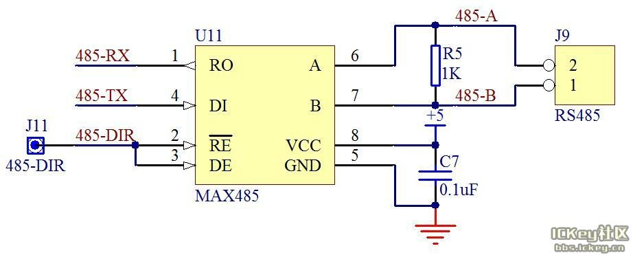
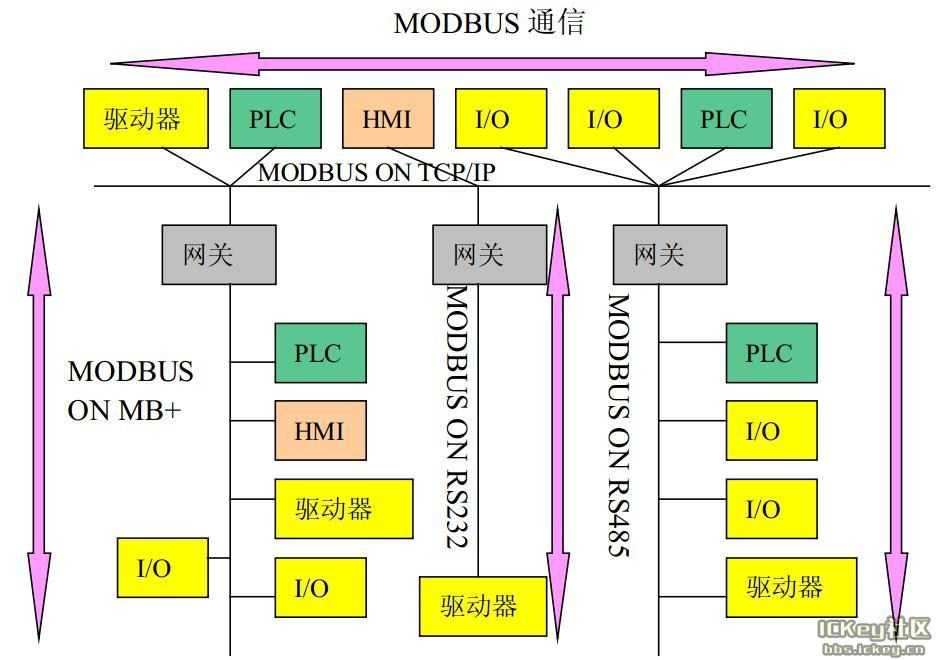
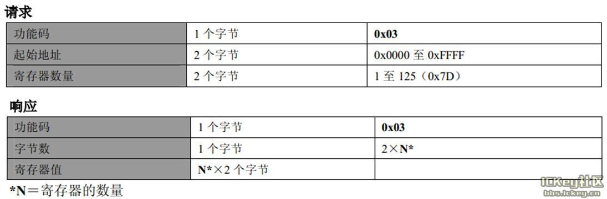
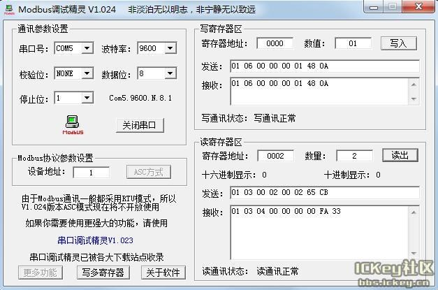

&emsp;&emsp;在工业控制、电力通讯、智能仪表等领域，通常情况下是采用串口通信的方式进行数据交换。最初采用的方式是`RS232`接口，由于工业现场比较复杂，各种电气设备会在环境中产生比较多的电磁干扰，会导致信号传输错误。除此之外，`RS232`接口只能实现点对点通信，不具备联网功能，最大传输距离也只能达到十几米，不能满足远距离通信要求。而`RS485`则解决了这些问题，数据信号采用差分传输方式，可以有效地解决共模干扰问题，最大距离可达`1200`米，并且允许多个收发设备接到同一条总线上。

### RS485通信

&emsp;&emsp;`RS232`标准是诞生于`RS485`之前的，但是`RS232`有几处不足的地方：

- 接口的信号电平值较高，达到十几`V`，使用不当容易损坏接口芯片，电平标准也与`TTL`电平不兼容。
- 传输速率有局限，不可以过高，一般到一两百千比特每秒(`Kb/s`)就到极限了。
- 接口使用信号线和`GND`与其它设备形成共地模式的通信，这种共地模式传输容易产生干扰，并且抗干扰性能也比较弱。
- 传输距离有限，最多只能通信几十米。
- 通信的时候只能两点之间进行通信，不能够实现多机联网通信。

&emsp;&emsp;针对`RS232`接口的不足，就不断出现了一些新的接口标准，`RS485`就是其中之一，它具备以下的特点：

1. 采用差分信号。我们在讲`A/D`的时候，讲过差分信号输入的概念，同时也介绍了差分输入的好处，最大的优势是可以抑制共模干扰。尤其当工业现场环境比较复杂，干扰比较多时，采用差分方式可以有效的提高通信可靠性。`RS485`采用两根通信线，通常用`A`和`B`或者`D+`和`D-`来表示。逻辑`1`以两线之间的电压差为`+(0.2~6)V`表示，逻辑`0`以两线间的电压差为`-(0.2~6)V`来表示，是一种典型的差分通信。
2. `RS485`通信速率快，最大传输速度可以达到`10Mb/s`以上。
3. `RS485`内部的物理结构，采用的是平衡驱动器和差分接收器的组合，抗干扰能力也大大增加。
4. 传输距离最远可以达到`1200`米左右，但是它的传输速率和传输距离是成反比的，只有在`100Kb/s`以下的传输速度，才能达到最大的通信距离，如果需要传输更远距离可以使用中继。
5. 可以在总线上进行联网实现多机通信，总线上允许挂多个收发器。从现有的`RS485`芯片来看，有可以挂`32`、`64`、`128`、`256`等不同个设备的驱动器。
6. `RS485`的接口非常简单，与`RS232`所使用的`MAX232`是类似的，只需要一个`RS485`转换器，就可以直接与单片机的`UART`串口连接起来，并且使用完全相同的异步串行通信协议。但是由于`RS485`是差分通信，因此接收数据和发送数据是不能同时进行的，也就是说它是一种半双工通信。那我们如何判断什么时候发送，什么时候接收呢？

&emsp;&emsp;`RS485`转换芯片很多，这节课我们以典型的`MAX485`为例讲解`RS485`通信：



<p align="center" style="color:green">图1 MAX485硬件接口</p>

&emsp;&emsp;`AX485`是美信(`Maxim`)推出的一款常用`RS485`转换器，其中`5`脚和`8`脚是电源引脚；`6`脚和`7`脚就是`RS485`通信中的`A`和`B`两个引脚；`1`脚和`4`脚分别接到单片机的`RXD`和`TXD`引脚上，直接使用单片机`UART`进行数据接收和发送；`2`脚和`3`脚是方向引脚，其中`2`脚是低电平使能接收器，`3`脚是高电平使能输出驱动器，我们把这两个引脚连到一起，平时不发送数据的时候，保持这两个引脚是低电平，让`MAX485`处于接收状态；当需要发送数据的时候，把这个引脚拉高，发送数据，发送完毕后再拉低这个引脚就可以了。为了提高`RS485`的抗干扰能力，需要在靠近`MAX485`的`A`和`B`引脚之间并接一个电阻，这个电阻阻值从`100`欧到`1K`都是可以的。
&emsp;&emsp;在进行`RS485`实验中，我们通信用的引脚必须是`P3.0`和`P3.1`(对于只有一个串口的单片机)，此外还有一个方向控制引脚，我们使用杜邦线将其连接到`P1.7`上去。`RS485`的另外一端，大家可以使用一个`USB`转`RS485`模块，用双绞线把开发板和模块上的`A`和`B`分别对应连起来，`USB`那头插入电脑，然后就可以进行通信了。
&emsp;&emsp;程序中需要注意的一点是：因为平常都是将`MAX485`设置为接收状态，只有在发送数据的时候才将`MAX485`改为发送状态，所以在命令发送函数前将`MAX485`方向引脚拉高，函数退出前再拉低。但是这里有一个细节，就是单片机的发送和接收中断产生的时刻都是在停止位的一半上，也就是说每当停止位传送了一半的时候，`RI`或`TI`就已经置位并且马上进入中断(如果中断使能的话)函数了，接收的时候自然不会存在问题，但发送的时候就不一样了：当紧接着向`SBUF`写入一个字节数据时，`UART`硬件会在完成上一个停止位的发送后，再开始新字节的发送。但如果此时不是继续发送下一个字节，而是已经发送完毕了，要停止发送并将`MAX485`方向引脚拉低以使`MAX485`重新处于接收状态时就有问题了，因为这时候最后的这个停止位实际只发送了一半，还没有彻底完成。所以在命令发送函数结束后需要增加`50us`延时，这`50us`的时间正好让剩下的一半停止位完成，那么这个时间自然就是由通信波特率决定的了，为波特率周期的一半(我自己编写的代码中没有延时`50us`的操作)。

``` cpp
#include "STC12C5A.H"

typedef unsigned char uint8;
typedef unsigned int  uint16;
typedef signed char int8;
typedef signed int  int16;

#define LOCK   0
#define UNLOCK !LOCK

sbit MAX485_DIR = P1 ^ 4; /* 设置MAX485信号的传输方向 */
sbit LED0 = P0 ^ 0;

const char send_rs485[] = {0x04, 0x00, 0x01, 0x31, 0x00, 0x36}; /* 向rs485发送的数据 */
volatile uint8 lock = LOCK; /* 为串口1和串口2的同步操作设置锁 */
uint8 recv_data[24] = {0}; /* 接收数据缓冲区 */

void uart_first_init ( void ) {
    SCON = 0x50; /* 0101_0000，8位可变波特率，无奇偶校验位 */
    TMOD = 0x21; /* 0011_0001，设置定时器1为8位自动重装计数器 */
    TH1 = 0xFD; /* 设置定时器1自动重装数 */
    TL1 = 0xFD;
    TR1 = 1; /* 开定时器1 */
    ES = 1; /* 允许串口中断 */
    EA = 1; /* 开总中断 */
}

void uart_first_send_byte ( uint8 dat ) {
    TI = 0; /* 清零串口发送完成中断请求标志 */
    SBUF = dat;

    while ( TI == 0 ); /* 等待发送完成 */

    TI = 0; /* 清零串口发送完成中断请求标志 */
}

void uart_second_init ( void ) { /* 9600bps@11.0592MHz */
    AUXR &= 0xF7; /* 波特率不倍速 */
    S2CON = 0x50; /* 8位数据，可变波特率 */
    AUXR |= 0x04; /* 独立波特率发生器时钟为Fosc，即1T */
    BRT = 0xDC; /* 设定独立波特率发生器重装值 */
    AUXR |= 0x10; /* 启动独立波特率发生器 */
    IE2 = 0X01; /* 允许串口2中断，ES2置为1 */
    EA = 1; /* 开总中断 */
}

void uart_second_send_byte ( uint8 i ) {
    uint8 temp = 0;
    IE2 = 0X00; /* 关串口2中断，ES2置为0 */
    S2CON = S2CON & 0XFD; /* 1111_1101，清零串口2发送完成中断请求标志 */
    S2BUF = i;

    do {
        temp = S2CON;
        temp = temp & 0x02;
    } while ( temp == 0 );

    S2CON = S2CON & 0XFD; /* 1111_1101，清零串口2发送完成中断请求标志 */
    IE2 = 0X01; /* 允许串口2中断，ES2 = 1 */
}

void delay1s ( void ) {
    unsigned char a, b, c;

    for ( c = 217; c > 0; c-- )
        for ( b = 171; b > 0; b-- )
            for ( a = 73; a > 0; a-- );
}

void main ( void ) {
    uart_first_init(); /* 初始化串口1 */
    uart_second_init(); /* 初始化串口2 */
    delay1s();

    while ( 1 ) {
        int send_order = 0; /* 命令发送的次序 */
        int print_order = 0; /* 打印数据的次序 */
        lock = LOCK; /* 首先要为数据发送操作上锁 */

        while ( lock != UNLOCK ) { /* 死循环，直到解锁 */
            MAX485_DIR = 1; /* 向MAX485发送命令 */

            for ( send_order = 0; send_order < sizeof ( send_rs485 ) / sizeof ( send_rs485[1] ); send_order++ ) {
                uart_second_send_byte ( send_rs485[send_order] );
            }

            MAX485_DIR = 0; /* 开始从MAX485接收数据 */
            delay1s();
        }

        for ( print_order = 0; print_order < 24; print_order++ ) { /* 打印接收到的数据 */
            uart_first_send_byte ( recv_data[print_order] );
        }

        delay1s();
    }
}

void uart_first_isr ( void ) interrupt 4 {
    volatile uint8 res = 0;

    if ( RI ) {
        RI = 0;
        res = SBUF;
        uart_first_send_byte ( res );
    } else {
        TI = 0;
    }
}

void uart_second_isr ( void ) interrupt 8 {
    volatile uint8 res = 0;
    static recv_true = 0; /* 判断接收数据的准确性，第一个数据为0x16则是正确的 */
    static uint8 recv_num = 0; /* 接收数据的次序 */
    lock = LOCK; /* 接收数据时需要上锁 */
    recv_true = 1; /* 默认情况下接收的数据是正确的 */
    recv_num = ( recv_num < 24 ) ? recv_num : 0; /* 判断是否小于24，否则设置为0 */
    res = S2CON;
    res = res & 0x01;
    LED0 = !LED0; /* 指示是否接收到数据 */

    if ( res == 1 ) {
        S2CON = S2CON & 0xFE; /* 1111_1110 */
        res = S2BUF;
        recv_data[recv_num++] = res; /* 将数据填入接收缓冲区中 */
    } else {
        S2CON = S2CON & 0xFD; /* 1111_1101 */
    }

    if ( recv_data[0] != 0x16 ) { /* 如果接收的第一个数据不是0x16，则将接收次序强制置为0 */
        recv_num = 0;
        recv_true = 0; /* 接收到的数据是错误的 */
    } else if ( recv_data[0] == 0x16 ) {
        recv_true = 1; /* 接收到的数据是正确的 */
    }

    if ( ( recv_num == 24 ) && ( recv_true == 1 ) ) { /* 接收到完整的数据，并且数据是正确的 */
        lock = UNLOCK; /* 数据接收完成时需要解锁 */
    }
}
```

### Modbus通信协议介绍

&emsp;&emsp;我们在学习串口通信时，通过串口发给单片机三条指令，让其做了三件不同的事情，分别是`buzz on`、`buzz off`和`showstr`。随着系统复杂性的增加，我们希望可以实现更多的指令。而指令越来越多，带来的后果就是代码非常杂乱无章，尤其是有些人喜欢写成`buzz on`、`buzz off`，而另外一些人喜欢写成`on buzz`、`off buzz`。导致不同开发人员写出来的程序代码不兼容，不同厂家的产品不能挂到一条总线上通信。
&emsp;&emsp;随着这种矛盾的日益严重，就会有聪明人找到更合理的解决方案，提出一些标准，今后的编程必须按照这个标准来，这种标准也是一种通信协议。但是和`UART`、`I2C`、`SPI`这些`位级`通信协议不同，这种通信协议是字节级别的，叫做`应用层通信协议`。在`1979`年由`Modicon`(现为施耐德电气公司的一个品牌)提出了全球第一个真正用于工业现场总线的协议，就是`Modbus`协议。

#### Modbus协议特点

&emsp;&emsp;Modbus协议是应用于电子控制器上的一种通用语言。通过此协议，控制器相互之间、控制器经由网络(例如以太网)和其他设备之间可以通信，已经成为一种工业标准。有了它，不同厂商生产的控制设备可以连成工业网络，进行集中监控。这种协议定义了一种控制器能够认识使用的数据结构，而不管它们是经过何种网络进行通信的。它描述了控制器请求访问其它设备的过程，如何回应来自其它设备的请求以及怎样侦测错误记录，它制定了通信数据的格局和内容的公共格式。
&emsp;&emsp;在进行多机通信的时候，Modbus协议规定每个控制器必须要知道它们的设备地址，识别按照地址发送过来的数据，决定是否要产生动作以及产生何种动作。如果要回应，控制器将生成的反馈信息用Modbus协议发出。
&emsp;&emsp;Modbus协议允许在各种网络体系结构内进行简单通信，每种设备(PLC、人机界面、控制面板、驱动程序、输入输出设备等)都能使用Modbus协议来启动远程操作，一些网关允许在几种使用Modbus协议的总线或网络之间的通信，如下图所示：

<p align="center" style="color:green">图2 Modbus网络体系结构实例</p>

### RTU协议帧数据

&emsp;&emsp;Modbus有两种通信传输方式，一种是ASCII模式，一种是RTU模式。由于ASCII模式的数据字节是7bit数据位，51单片机无法实现，而且实际应用的也比较少，所以这里我们只用RTU模式。两种模式相似，会用一种另外一种也就会了。一条典型的RTU数据帧如下表所示：

|    起始位  | 设备地址 | 功能代码 |  数据  | CRC校验 | 结束符|
|-----------|---------|--------|--------|---------|-------|
|T1-T2-T3-T4| 8Bits   | 8Bits  |n个8Bits | 16Bits |T1-T2-T3-T4|

&emsp;&emsp;与之前我们讲解实用串口通信程序时用的原理相同，一次发送的数据帧必须是作为一个连续的数据流进行传输。我们在使用串口通信程序中采用的方法是定义30ms，如果数据接收时超过了30ms还没有接收到下一个字节，就认为这次的数据结束。而Modbus的RTU模式规定不同数据帧之间的间隔是`3.5`个字节通信时间以上。如果在一帧数据完成之前有超过`3.5`个字节时间的停顿，接收设备将刷新当前的消息并假定下一个字节是一个新的数据帧的开始。同样的，如果一个新消息在小于`3.5`个字节时间内接着前边一个数据开始，接收设备将会认为它是前一帧数据的延续，这将会导致一个错误，因此大家看RTU数据帧最后还有16bit的CRC校验。
&emsp;&emsp;**起始位和结束符**：RTU数据帧前后都至少有`3.5`个字节的时间间隔，起始位和结束符实际上没有任何数据，`T1-T2-T3-T4`代表的是时间间隔`3.5`个字节以上的时间，而真正有意义的第一个字节是设备地址。
&emsp;&emsp;**设备地址**：在多机通信的时候，数据那么多，我们依靠什么判断这个数据帧是哪个设备的呢？没错，就是依靠这个设备地址字节。每个设备都有一个自己的地址，当设备接收到一帧数据后，程序首先对设备地址字节进行判断比较，如果与自己的地址不同，则对这帧数据直接不予理会；如果与自己的地址相同，就要对这帧数据进行解析，按照之后的功能码执行相应的功能。如果地址是0x00，则认为是一个广播命令，就是所有的从机设备都要执行的指令。
&emsp;&emsp;**功能代码**：在第二个字节功能代码字节中，Modbus规定了部分功能代码，此外也保留了一部分功能代码作为备用或者用户自定义，如下表所示：

功能码 | 名称 | 作用
------|------|-----
01 | 读取线圈状态 | 取得一组逻辑线圈的当前状态(ON/OFF)
02 | 读取输入状态 | 取得一组开关输入的当前状态(ON/OFF)
03 | 读取保持寄存器 | 在一个或多个保持寄存器中取得当前的二进制值
04 | 读取输入寄存器 | 在一个或多个输入寄存器中取得当前的二进制值
05 | 强置单线圈 | 强置一个逻辑线圈的通断状态
06 | 预置单寄存器 | 把具体二进值装入一个保持寄存器
07 | 读取异常状态 | 取得8个内部线圈的通断状态，这8个线圈的地址由控制器决定，用户逻辑可以将这些线圈定义，以说明从机状态，短报文适宜于迅速读取状态
08 | 回送诊断校验 | 把诊断校验报文送从机，以对通信处理进行评鉴
09 | 编程(只用于484) | 使主机模拟编程器作用，修改PC从机逻辑
10 | 控询(只用于484) | 可使主机与一台正在执行长程序任务从机通信，探询该从机是否已完成其操作任务，仅在含有功能码9的报文发送后，本功能码才发送
11 | 读取事件计数 | 可使主机发出单询问，并随即判定操作是否成功，尤其是该命令或其它应答产生通信错误时
12 | 读取通信事件记录 | 可使主机检索每台从机的ModBus事务处理通信事件记录。如果某项事务处理完成，记录会给出有关错误
13 | 编程(184/384/484/584) | 可使主机模拟编程器功能修改PC从机逻辑
14 | 探询(184/384/484/584) | 可使主机与正在执行任务的从机通信，定期控询该从机是否已完成其程序操作，仅在含有功能13的报文发送后，本功能码才得发送
15 | 强置多线圈 | 强置一串连续逻辑线圈的通断
16 | 预置多寄存器 | 把具体的二进制值装入一串连续的保持寄存器
17 | 报告从机标识 | 可使主机判断编址从机的类型及该从机运行指示灯的状态
18 | 884和MICRO_84 | 可使主机模拟编程功能，修改PC状态逻辑
19 | 重置通信链路 | 发生非可修改错误后，是从机复位于已知状态，可重置顺序字节
20 | 读取通用参数(584L) | 显示扩展存储器文件中的数据信息
21 | 写入通用参数(584L) | 把通用参数写入扩展存储文件，或修改
22~64 | 保留作扩展功能备用 |
65~72 | 保留以备用户功能所用 | 留作用户功能的扩展编码
73~119 | 非法功能 |
120~127 | 保留 | 留作内部作用
128~255 | 保留 | 用于异常

程序对功能码的处理，就是来检测这个字节的数值，然后根据其数值来做相应的功能处理。
&emsp;&emsp;**数据**：跟在功能代码后边的是n个8bit的数据。这个n值的到底是多少，是功能代码来确定的，不同的功能代码后边跟的数据数量不同。例如，如果功能码是0x03，也就是读保持寄存器，那么主机发送数据n的组成部分就是：2个字节的寄存器起始地址加上2个字节的寄存器数量N。从机数据n的组成部分是：1个字节的字节数，因为我们回复的寄存器的值是2个字节，所以这个字节数也就是2N个，再加上2N个寄存器的值，如图3所示：

<p align="center" style="color:green">图3 读保持寄存器数据结构</p>
&emsp;&emsp;**CRC校验**：CRC校验是一种数据算法，是用来校验数据对错的。CRC校验函数把一帧数据除最后两个字节外，前边所有的字节进行特定的算法计算，计算完后生成了一个16bit的数据，作为CRC校验码，添加在一帧数据的最后。接收方接收到数据后，同样会把前边的字节进行CRC计算，计算完了再和发过来的16bit的CRC数据进行比较，如果相同则认为数据正常，没有出错；如果比较不相同，则说明数据在传输中发生了错误，这帧数据将被丢弃，就像没收到一样，而发送方会在得不到回应后做相应的处理错误处理。
&emsp;&emsp;RTU模式的每个字节的位是这样分布的：1个起始位、8个数据位(最小有效位先发送)、1个奇偶校验位(如果无校验则没有这一位)、1位停止位(有校验位时)或者2个停止位(无校验位时)。
### Modbus多机通信例程
&emsp;&emsp;给从机下发不同的指令，从机去执行不同的操作，这个就是判断一下功能码即可，和我们前边学的实用串口例程是类似的。多机通信，无非就是添加了一个设备地址判断而已，难度也不大。我们找了一个Modbus调试精灵，通过设置设备地址，读写寄存器的地址以及数值数量等参数，可以直接替代串口调试助手，比较方便的下发多个字节的数据，如图4所示。我们先来就图中的设置和数据来对Modbus做进一步的分析，图中的数据来自于调试精灵与我们接下来要讲的例程之间的交互。

<p align="center" style="color:green">图4 Modbus调试精灵</p>
&emsp;&emsp;我们的USB转RS485模块虚拟出的是COM5，波特率9600，无校验位，数据位是8位，1位停止位，设备地址假设为1。写寄存器的时候，如果我们要把`01`写到一个地址是`0000`的寄存器地址里，点一下`写入`，就会出现发送指令`01 06 00 00 00 01 48 0A`。我们来分析一下这帧数据，其中`01`是设备地址，`06`是功能码，代表写寄存器这个功能，后边跟`00 00`表示的是要写入的寄存器的地址，`00 01`就是要写入的数据，`48 0A`就是CRC校验码，这是软件自动算出来的。而根据Modbus协议，当写寄存器的时候，从机成功完成该指令的操作后，会把主机发送的指令直接返回，我们的调试精灵会接收到这样一帧数据`01 06 00 00 00 01 48 0A`。
&emsp;&emsp;假如我们现在要从寄存器地址`0002`开始读取寄存器，并且读取的数量是2个。点一下`读出`，就会出现发送指令`01 03 00 02 00 02 65 CB`。其中`01`是设备地址，`03`是功能码，代表读寄存器这个功能，`00 02`就是读寄存器的起始地址，后一个`00 02`就是要读取2个寄存器的数值，`65 CB`就是CRC校验。而接收到的数据是`01 03 04 00 00 00 00 FA 33`。其中`01`是设备地址，`03`是功能码，`04`代表的是后边读到的数据字节数是4个，`00 00 00 00`分别是地址为`00 02`和`00 03`的寄存器内部的数据，而`FA 33`就是CRC校验了。似乎越来越明朗了，所谓的Modbus通信协议，无非就是主机下发了不同的指令，从机根据指令的判断来执行不同的操作而已。