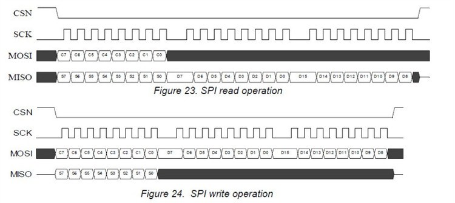

&emsp;&emsp;`SPI`(`Serial Peripheral interface`，串行外围设备接口)协议是主从模式，即从机不主动发起访问，总是被动执行操作。其接口如下：

- `CSN`：片选信号。
- `SCK`：时钟信号。
- `MOSI`(`master output slave input`)：主机输出从机输入，可以理解主机写从设备。
- `MISO`(`master input slave output`)：主机输入从机输出，可以理解主机读从设备。

&emsp;&emsp;`SPI`协议自然是串行地传输数据，每次按`1bit`读写设备，而不是并行每次`1byte`(`8bit`)传输。下图为`SPI`读时序和写时序：



&emsp;&emsp;按照读写时序，输出字节(`MOSI`)就会从`MSB`循环输出，同将输入字节(`MISO`)从`LSB`循环移入，每次移动一位。
&emsp;&emsp;单字节读时序代码如下：

``` cpp
/* 下降沿读数据，每次读取1bit */
uint8 SPI_Read_OneByte ( void ) {
    uint8 i;
    uint8 temp = 0;

    for ( i = 0; i < 8; i++ ) {
        temp <<= 1;
        SCK = 1;

        /* 读取最高位，保存至最末尾，通过左移位完成读整个字节 */
        if ( MISO ) {
            temp |= 0x01;
        } else {
            temp &= ~0x01;
        }

        /* 下降沿来了(SCK从1至0)，MISO上的数据将发生改变，稳定后读取存入temp */
        SCK = 0;
    }

    return temp; /* SPI读取的一字节数据 */
}
```

&emsp;&emsp;单字节写时序代码如下：

``` cpp
/* 参数u8_writedata是SPI写入的一字节数据。上升沿写数据，每次写入1bit */
void SPI_Write_OneByte ( uint8 u8_writedata ) {
    uint8 i;

    for ( i = 0; i < 8; i++ ) {
        if ( u8_writedata & 0x80 ) { /* 判断最高位，总是发送最高位 */
            MOSI_ON; /* MOSI输出1，数据总线准备数据1 */
        } else {
            MOSI_OFF; /* MOSI输出0，数据总线准备数据0 */
        }

        SCK = 1; /* 上升沿来了(SCK从0至1)，数据总线上的数据写入到器件 */
        u8_writedata <<= 1; /* 左移抛弃已经输出的最高位 */
        SCK = 0; /* 拉低SCK信号，初始化为0 */
    }
}
```

在此基础上可以写出`nRF24L01`寄存器的读写函数。`nRF24L01`寄存器写入函数如下：

``` cpp
void nRF24L01_WriteReg ( uint8 addr, uint8 value ) {
    CSN_OFF(); /* CS片选拉低 */
    SPI_Write_OneByte ( addr | WR ); /* SPI写地址命令 */
    SPI_Write_OneByte ( value ); /* SPI写数据 */
    CSN_ON(); /* CS片选拉高 */
}
```

`nRF24L01`读寄存器函数如下：

``` cpp
uint8 nRF24L01_ReadReg ( uint8 addr ) {
    uint8 value;
    CSN_OFF(); /* CS片选拉低 */
    SPI_Write_OneByte ( addr | RR ); /* SPI写地址命令 */
    value = SPI_Read_OneByte(); /* SPI读数据 */
    CSN_ON(); /* CS片选拉高 */
    return value;
}
```

可以将读写程序进行整合：

``` cpp
/* 参数u8_writedata是SPI写入的一字节数据。上升沿写，下降沿读 */
uint8 SPI_WriteAndRead_OneByte ( uint8 u8_writedata ) {
    uint8 i;
    uint8 u8_readdata = 0x00;

    for ( i = 0; i < 8; i++ ) {
        u8_readdata <<= 1; /* 读取MISO的8次输入的值，存入u8_readdata */

        if ( u8_writedata & 0x80 ) { /* 判断最高位，总是写最高位(输出最高位) */
            MOSI_ON; /* MOSI输出1，数据总线准备数据1 */
        } else {
            MOSI_OFF; /* MOSI输出0，数据总线准备数据0 */
        }

        u8_writedata <<= 1; /* 左移抛弃已经输出的最高位 */
        SCK = 1; /* 上升沿来了(SCK从0至1)，数据总线上的数据写入器件 */

        if ( MISO ) { /* 读取最高位，保存至最末尾，通过左移位完成读整个字节 */
            u8_readdata |= 0x01;
        } else {
            u8_readdata &= ~0x01;
        }

        SCK = 0; /* 下降沿来了(SCK从1至0)，MISO上将产生新的数据，读取存入u8_readdata */
    }

    return u8_readdata; /* SPI读取的一字节数据 */
}
```

---

&emsp;&emsp;`STM32`模拟`SPI`时序的代码如下：

``` cpp
#define MOSI_H GPIO_SetBits ( GPIOA, GPIO_Pin_7 )
#define MOSI_L GPIO_ResetBits ( GPIOA, GPIO_Pin_7 )
#define SCLK_H GPIO_SetBits ( GPIOA, GPIO_Pin_5 )
#define SCLK_L GPIO_ResetBits ( GPIOA, GPIO_Pin_5 )
#define MISO   GPIO_ReadInputDataBit ( GPIOA, GPIO_Pin_6 )

u8 SD_SPI_ReadWriteByte ( u8 dt ) {
    u8 i;
    u8 temp = 0;

    for ( i = 8; i > 0; i-- ) {
        if ( dt & 0x80 ) {
            MOSI_H;
        } else {
            MOSI_L;
        }

        dt <<= 1;
        SCLK_H;
        temp <<= 1;

        if ( MISO ) {
            temp++;
        }

        SCLK_L;
    }

    return temp;
}

void SD_SPI_Init ( void ) {
    GPIO_InitTypeDef GPIO_InitStructure;
    RCC_APB2PeriphClockCmd ( RCC_APB2Periph_GPIOA, ENABLE );
    GPIO_InitStructure.GPIO_Pin   = GPIO_Pin_5 | GPIO_Pin_7 | GPIO_Pin_3;
    GPIO_InitStructure.GPIO_Mode  = GPIO_Mode_Out_PP; /* 推挽输出 */
    GPIO_InitStructure.GPIO_Speed = GPIO_Speed_50MHz;
    GPIO_Init ( GPIOA, &GPIO_InitStructure );
    GPIO_InitStructure.GPIO_Pin   = GPIO_Pin_6;
    GPIO_InitStructure.GPIO_Mode  = GPIO_Mode_IPU;
    GPIO_InitStructure.GPIO_Speed = GPIO_Speed_50MHz;
    GPIO_Init ( GPIOA, &GPIO_InitStructure );
    GPIO_SetBits ( GPIOA, GPIO_Pin_5 | GPIO_Pin_7 | GPIO_Pin_6 );
    delay_ms ( 2 );
    SD_CS = 1;
}
```