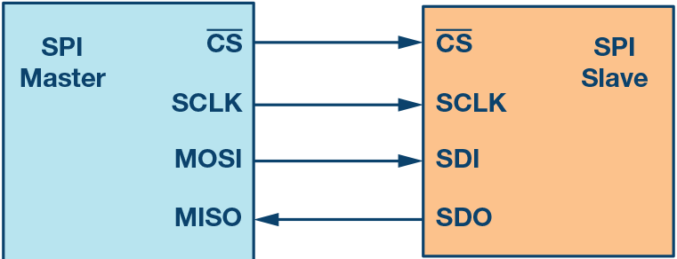
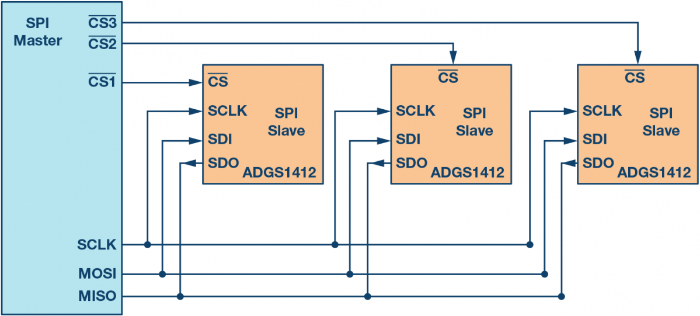

&emsp;&emsp;`SPI`是微控制器和外围芯片之间使用最广泛的接口之一，是一种全双工、主从式接口。<!--more-->
&emsp;&emsp;`SPI`接口有`4`个信号：

- `SCK`：时钟信号。
- `CSN`：片选信号。
- `MOSI`：主机输出，从机输入。
- `MISO`：主机输入，从机输出。

&emsp;&emsp;产生时钟信号的器件称为`主机`。主机和从机之间传输的数据与主机产生的时钟同步。
&emsp;&emsp;`SPI`接口只能有一个主机，但可以有一个或多个从机。下图显示了主机和从机之间的`SPI`连接：

&emsp;&emsp;片选信号用于选择从机，这通常是一个低电平有效信号。当片选信号拉高时，从机与`SPI`总线断开连接。当使用多个从机时，主机需要为每个从机提供单独的片选信号。

&emsp;&emsp;`MOSI`和`MISO`是数据线：

- `MOSI`将数据从主机发送到从机。
- `MISO`将数据从从机发送到主机。

它们是根据时钟信号的跳变沿来对数据进行传输。