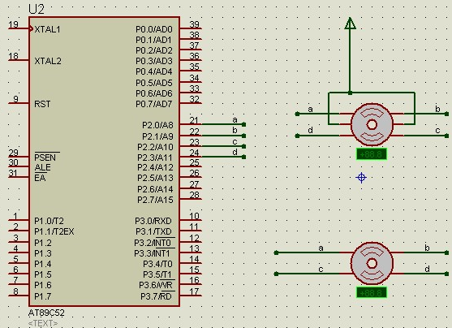
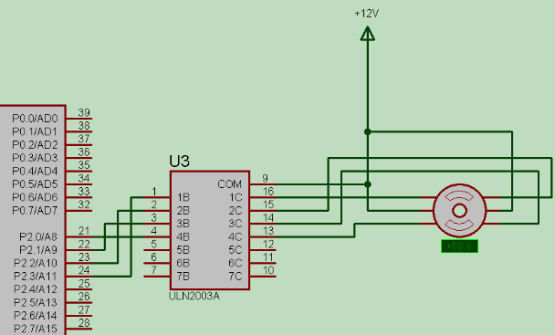

&emsp;&emsp;本篇博客来源于[51proteus仿真：proteus中的步进电机的接法与时序](http://www.eeworld.com.cn/mcu/article_2017011033190.html)，内容经过测试和修改，感谢原作者。  
&emsp;&emsp;proteus中的步进电机有两种，即六线制(MOTOR-STEPPER)和四线制(MOTOR-BISTEPPER)。六线制的左右中间两根线接电源，仍然剩下四根线。但是这四根的顺序和四线制的不同，如下图所示，注意a、b、c和d的顺序：


&emsp;&emsp;在实际情况中，单片机是不能直接拖动步进电机的，需要用ULN2003类似的元器件，两个步进电机都是四相电机。
&emsp;&emsp;如果用四拍，那么P2输出的(顺时针)顺序就是0x03、0x06、0x0c和0x09：

``` bash
a 1 0 0 1
b 1 1 0 0
c 0 1 1 0
d 0 0 1 1
```

&emsp;&emsp;如果用八拍，那么P2输出的(顺时针)顺序就是0x01、0x03、0x02、0x06、0x04、0x0c、0x08和0x09：

``` bash
a 1 1 0 0 0 0 0 1
b 0 1 1 1 0 0 0 0
c 0 0 0 1 1 1 0 0
d 0 0 0 0 0 1 1 1
```

代码如下所示：

``` c
/* 4相4拍方式 */
const unsigned char step_table[] = {0x30, 0x60, 0xc0, 0x90};

void dianji ( unsigned char Flag, unsigned int i ) {
    unsigned int temp = i;

    if ( Flag == 0 ) { /* 正转 */
        for ( ; temp > 0; temp-- ) {
            unsigned char j = 0;

            for ( j = 0; j <= 3; j++ ) {
                P3 = step_table[j];
                delay_ms ( 10 );
            }
        }
    } else { /* 反转 */
        for ( ; temp > 0; temp-- ) {
            unsigned char j = 4;

            for ( j = 4; j > 0; j-- ) {
                P3 = step_table[j - 1];
                delay_ms ( 10 );
            }
        }
    }
}
```