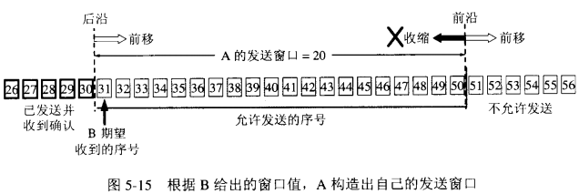
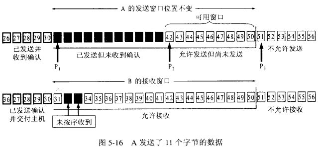
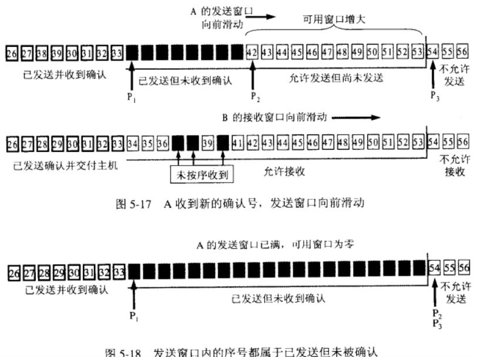
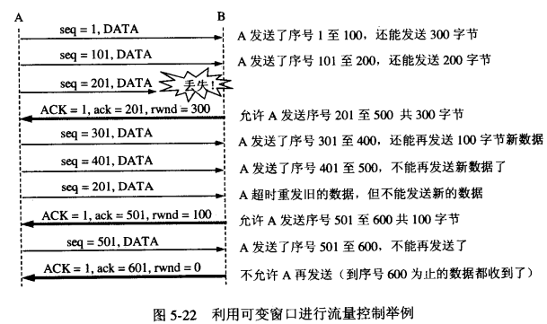

&emsp;&emsp;`TCP`协议作为一个可靠的面向流的传输协议，其可靠性和流量控制由滑动窗口协议保证，而拥塞控制则由控制窗口结合一系列的控制算法实现。<!--more-->

### 滑动窗口协议

&emsp;&emsp;所谓滑动窗口协议，自己理解有两点：

- `窗口`对应的是一段可以被发送者发送的字节序列，其连续的范围称之为`窗口`。
- `滑动`则是指这段`允许发送的范围`是可以随着发送的过程而变化的，方式就是按顺序`滑动`。

&emsp;&emsp;在引入一个例子来说这个协议之前，我觉得很有必要先了解以下前提：

- `TCP`协议的两端分别为发送者`A`和接收者`B`，由于是全双工协议，因此`A`和`B`应该分别维护着一个独立的发送缓冲区和接收缓冲区，由于对等性(`A`发`B`收、`B`发`A`收)，我们以`A`发送`B`接收的情况作为例子。
- 发送窗口是发送缓存中的一部分，是可以被`TCP`协议发送的那部分，其实应用层需要发送的所有数据都被放进了发送者的发送缓冲区。
- 发送窗口中相关的有`4`个概念：

1. 已发送并收到确认的数据(不在发送窗口和发送缓冲区之内)。
2. 已发送但未收到确认的数据(位于发送窗口之中)。
3. 允许发送但尚未发送的数据。
4. 发送窗口外发送缓冲区内暂时不允许发送的数据。

- 每次成功发送数据之后，发送窗口就会在发送缓冲区中按顺序移动，将新的数据包含到窗口中准备发送。

&emsp;&emsp;`TCP`建立连接的初始，`B`会告诉`A`自己的接收窗口大小，比如为`20`，字节`31`至`50`为发送窗口。

&emsp;&emsp;`A`发送`11`个字节后，发送窗口位置不变，`B`接收到了乱序的数据分组：

&emsp;&emsp;只有当`A`成功发送了数据，即发送的数据得到了`B`的确认之后，才会移动滑动窗口离开已发送的数据；同时`B`则确认连续的数据分组，对于乱序的分组则先接收下来，避免网络重复传递：

### 流量控制

&emsp;&emsp;所谓流量控制，主要是接收方传递信息给发送方，使其不要发送数据太快，是一种端到端的控制。主要的方式就是返回的`ACK`中会包含自己的接收窗口的大小，并且利用大小来控制发送方的数据发送：

&emsp;&emsp;这里面涉及到一种情况，如果`B`已经告诉`A`自己的缓冲区已满，于是`A`停止发送数据；等待一段时间后，`B`的缓冲区出现了富余，于是给`A`发送报文：我的`rwnd`大小为`400`。但是这个报文不幸地丢失了，于是就出现`A`等待`B`的通知、同时`B`等待`A`发送数据的死锁状态。为了处理这种问题，`TCP`引入了`Persistence Timer`，当`A`收到对方的零窗口通知时，就启用该计时器，如果定时时间到了，则发送一个`1`字节的探测报文，对方会回应自身的接收窗口大小，如果结果仍为`0`，则重设`Persistence Timer`，继续等待。