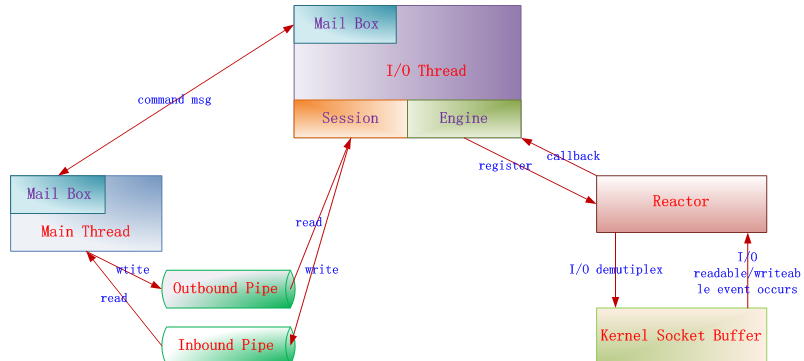
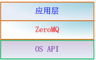
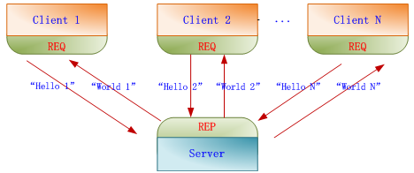
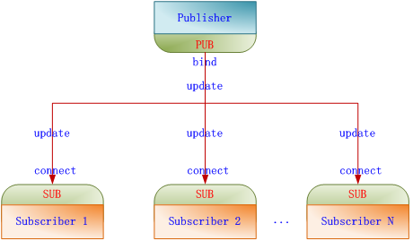
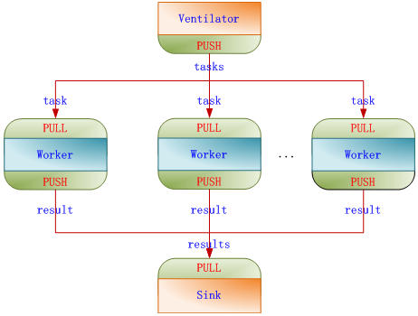
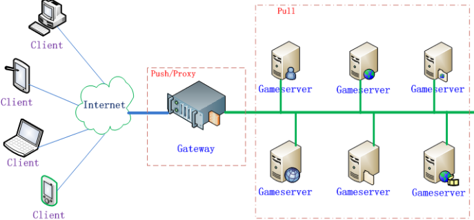

&emsp;&emsp;`ZeroMQ`是一种基于消息队列的多线程网络库，其对套接字类型、连接处理、帧甚至路由的底层细节进行抽象，提供跨越多种传输协议的套接字。`ZeroMQ`是网络通信中新的一层，介于应用层和传输层之间(按照`TCP/IP`划分)，其是一个可伸缩层，可并行运行或分散在分布式系统间。
<!--more-->

### 系统架构

#### 总体架构

&emsp;&emsp;`ZeroMQ`几乎所有的`I/O`操作都是异步的，主线程不会被阻塞。`ZeroMQ`会根据用户调用`zmq_init`函数时传入的接口参数，创建对应数量的`I/O Thread`。每个`I/O Thread`都有与之绑定的`Poller`。`Poller`采用经典的`Reactor`模式实现，它根据不同操作系统平台使用不同的网络`I/O`模型(`select`、`poll`、`epoll`、`devpoll`、`kequeue`等)。
&emsp;&emsp;主线程与`I/O`线程通过`Mail Box`传递消息来进行通信。`Server`开始监听或者`Client`发起连接时，在主线程中创建`zmq_connecter`或`zmq_listener`，通过`Mail Box`发消息的形式将其绑定到`I/O`线程，`I/O`线程会把`zmq_connecter`或`zmq_listener`添加到`Poller`中用以侦听读写事件。`Server`与`Client`在第一次通信时，会创建`zmq_init`来发送`identity`，用以进行认证。认证结束后，双方会为此次连接创建`Session`，以后双方就通过`Session`进行通信。每个`Session`都会关联到相应的读写管道，主线程收发消息只是分别从管道中读写数据。`Session`并不实际跟`kernel`交换`I/O`数据，而是通过`plugin`到`Session`中的`Engine`来与`kernel`交换`I/O`数据。

#### 所处层次

&emsp;&emsp;`ZeroMQ`不是单独的服务或者程序，仅仅是一套组件，其封装了网络通信、消息队列、线程调度等功能，向上层提供简洁的`API`。应用程序通过加载库文件，调用`API`函数来实现高性能网络通信。

#### 消息模型

&emsp;&emsp;`ZeroMQ`将消息通信分成`4`种模型，分别是一对一结对模型(`Exclusive-Pair`)、请求回应模型(`Request-Reply`)、发布订阅模型(`Publish-Subscribe`)、推拉模型(`Push-Pull`)。这`4`种模型总结出了通用的网络通信模型，在实际中可以根据应用需要，组合其中的`2`种或多种模型来形成自己的解决方案。
&emsp;&emsp;**对一结对模型**：最简单的`1`对`1`消息通信模型，可以认为是一个`TCP Connection`，但是`TCP Server`只能接受一个连接。数据可以双向流动，这点不同于后面的请求回应模型。
&emsp;&emsp;**请求回应模型**：由请求端发起请求，然后等待回应端应答。一个请求必须对应一个回应，从请求端的角度来看是`发-收`配对，从回应端的角度是`收-发`配对。和一对一结对模型的区别在于请求端可以是`1`至`N`个。该模型主要用于远程调用及任务分配等，`Echo`服务就是这种经典模型的应用。

&emsp;&emsp;**发布订阅模型**：发布端单向分发数据，且不关心是否把全部信息发送给订阅端。如果发布端开始发布信息时，订阅端尚未连接上来，则这些信息会被直接丢弃。订阅端未连接导致信息丢失的问题，可以通过与请求回应模型组合来解决。订阅端只负责接收，而不能反馈，且在订阅端消费速度慢于发布端的情况下，会在订阅端堆积数据。该模型主要用于数据分发。天气预报、微博明星粉丝可以应用这种经典模型。

&emsp;&emsp;**推拉模型**：`Server`端作为`Push`端，而`Client`端作为`Pull`端，如果有多个`Client`端同时连接到`Server`端，则`Server`端会在内部做一个负载均衡，采用平均分配的算法，将所有消息均衡发布到Client端上。与发布订阅模型相比，推拉模型在没有消费者的情况下，发布的消息不会被消耗掉；在消费者能力不够的情况下，能够提供多消费者并行消费解决方案。该模型主要用于多任务并行。

### 通信协议

&emsp;&emsp;`ZeroMQ`提供进程内、进程间、机器间、广播等四种通信协议。通信协议配置简单，用类似于`URL`形式的字符串指定即可，格式分别为`inproc://`、`ipc://`、`tcp://`和`pgm://`。`ZeroMQ`会自动根据指定的字符串解析出协议、地址、端口号等信息。

#### 应用场景

&emsp;&emsp;应用`ZeroMQ`的`Push-Pull`模型实现联众游戏服务器的`热插拔`、负载均衡和消息派发。按照下图部署服务器，`Push`端充当`Gateway`，作为一组游戏服务器集群最上层的一个`Proxy`，起负载均衡的作用，所有`Gameserver`作为`Pull`端。当一个请求到达`Push`端(`Gateway`)时，`Push`端根据一定的分配策略将任务派发到`Pull`端(`Gameserver`)。以联众某款游戏`A`为例，游戏`A`刚上线时，预计最大同时在线人数是`10W`，单台`Gameserver`并发处理能力为`1W`，需要`10`台`Gameserver`。由于游戏A可玩性非常好，半个月后最大同时在线人数暴增到`50W`，那么不需要在某天的凌晨将`Gateway`和`Gameserver`停机，只需要随时在机房新添加`40`台`Gameserver`，启动并连接到`Gateway`即可。
&emsp;&emsp;`ZeroMQ`中对`Client`和`Server`的启动顺序没有要求，`Gameserver`之间如果需要通信的话，`Gameserver`的应用层不需要管理这些细节，`ZeroMQ`已经做了重连处理。

