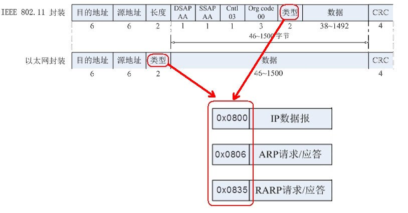
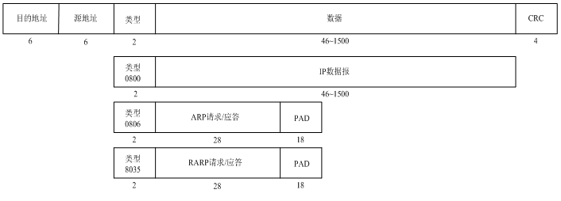

&emsp;&emsp;链路层封包格式如下：



&emsp;&emsp;`MAC`头部(有线局域网)如下(`CRC`、`PAD`在组包时可以忽略)：



&emsp;&emsp;链路层数据包的其中一种情况：

``` cpp
unsigned char msg[1024] = {
    /* 组MAC(14直接) */
    0xb8, 0x88, 0xe3, 0xe1, 0x10, 0xe6, /* dst_mac: b8:88:e3:e1:10:e6 */
    0xc8, 0x9c, 0xdc, 0xb7, 0x0f, 0x19, /* src_mac: c8:9c:dc:b7:0f:19 */
    0x08, 0x00,                         /* 类型：0x0800(IP协议) */
};
```

&emsp;&emsp;接收的链路层数据包，并对其进行简单分析：

``` cpp
#include <stdio.h>
#include <string.h>
#include <stdlib.h>
#include <sys/socket.h>
#include <netinet/in.h>
#include <arpa/inet.h>
#include <netinet/ether.h>
​
int main ( int argc, char *argv[] ) {
    int i = 0;
    unsigned char buf[1024] = "";
    int sock_raw_fd = socket ( PF_PACKET, SOCK_RAW, htons ( ETH_P_ALL ) );
​
    while ( 1 ) {
        unsigned char src_mac[18] = "";
        unsigned char dst_mac[18] = "";
        recvfrom ( sock_raw_fd, buf, sizeof ( buf ), 0, NULL, NULL ); /* 获取链路层的数据帧 */
        /* 从buf里提取目的mac、源mac */
        sprintf ( dst_mac, "%02x:%02x:%02x:%02x:%02x:%02x", buf[0], buf[1], buf[2], buf[3], buf[4], buf[5] );
        sprintf ( src_mac, "%02x:%02x:%02x:%02x:%02x:%02x", buf[6], buf[7], buf[8], buf[9], buf[10], buf[11] );
​
        if ( buf[12] == 0x08 && buf[13] == 0x00 ) { /* 判断是否为IP数据包 */
            printf ( "______________IP数据报_______________\n" );
            printf ( "MAC:%s >> %s\n", src_mac, dst_mac );
        } else if ( buf[12] == 0x08 && buf[13] == 0x06 ) { /* 判断是否为ARP数据包 */
            printf ( "______________ARP数据报_______________\n" );
            printf ( "MAC:%s >> %s\n", src_mac, dst_mac );
        } else if ( buf[12] == 0x80 && buf[13] == 0x35 ) { /* 判断是否为RARP数据包 */
            printf ( "______________RARP数据报_______________\n" );
            printf ( "MAC:%s>>%s\n", src_mac, dst_mac );
        }
    }
​
    return 0;
}
```

注意，要以管理者权限运行程序。