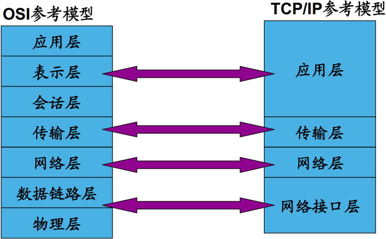
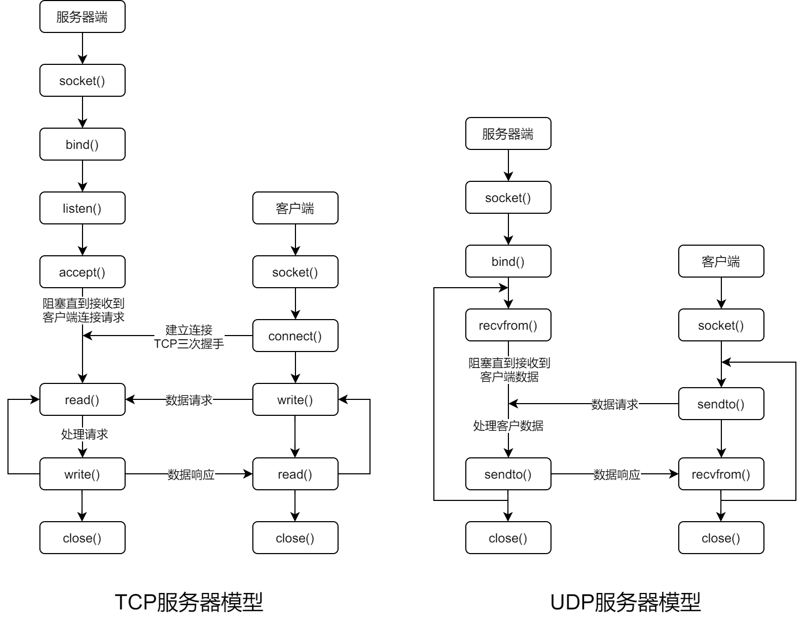

### 网络模型

&emsp;&emsp;网络模型如下图所示：



### TCP/IP协议族

&emsp;&emsp;`TCP/IP`实际上一个协同工作的通信家族，为网络通信提供通路。
&emsp;&emsp;`TCP/IP`协议族大体上分为`3`部分：

- `Internet`协议(`IP`)。
- 传输控制协议(`TCP`)、用户数据报协议(`UDP`)。
- 应用层协议，例如文件传送协议(`FTP`)、简单邮件传送程序(`SMTP`)。

### 网络层

&emsp;&emsp;网络层主要包括`Internet`协议(`IP`)、网际控制报文协议(`ICMP`)、地址解析协议(`ARP`)：

- `IP`：负责在源地址和目的地址之间提供非连接型传递服务，传输来自较高层软件的`数据报文`。
- `ICMP`：报告网络上的某些出错情况，允许网际路由器传输差错信息或测试报文。
- `ARP`：在`32`位`IP`地址和`48`位物理地址之间执行翻译。

### 传输层

&emsp;&emsp;传输层包括传输控制协议(`TCP`)、用户数据报文协议(`UDP`)。

- `TCP`：在传送数据之前建立对话，可靠地发送和接收网络数据。
- `UDP`：提供不可靠的数据传输服务，而不必在传送数据之前建立对话。

### Socket

&emsp;&emsp;`Linux`中的网络编程通过`socket`实现，它是一种文件描述符。
&emsp;&emsp;`socket`有如下`3`种类型：

- 流式套接字(`SOCK_STREAM`)：流式的套接字提供可靠的、面向连接的通讯流，它使用了`TCP`协议。
- 数据报套接字(`SOCK_DGRAM`)：数据报套接字提供不可靠的、无连接的通讯流，它使用了`UDP`协议。
- 原始套接字(`SOCK_RAW`)：原始套接字可以对低层协议直接进行访问，例如`IP`或`ICMP`。

### 地址转换

&emsp;&emsp;`IP`地址通常用数字加点的形式表示，例如`192.168.0.1`。`struct in_addr`使用的`IP`地址是由`32`位整数表示的。
&emsp;&emsp;为了进行转换，可以使用下面`2`个函数：

``` cpp
int inet_aton ( const char *cp, struct in_addr *inp );
char *inet_ntoa ( struct in_addr in );
```

- `inet_aton`是将`a.b.c.d`形式的`IP`地址转换为`32`位的`IP`地址，并存储在`inp`指向的内存。
- `inet_ntoa`是将`32`位`IP`地址转换为`a.b.c.d`的格式，并返回地址字符串。

### 字节序转换

&emsp;&emsp;不同类型的`CPU`对变量的字节存储顺序可能是不同的：

1. 有的`CPU`是高位在前，低位在后。
2. 有的`CPU`是低位在前，高位在后。

&emsp;&emsp;网络传输的数据顺序要求是统一的。可以使用如下转换函数：

- `htons`：把`unsigned short`类型数据从主机序转换到网络序。
- `htonl`：把`unsigned long`类型数据从主机序转换到网络序。
- `ntohs`：把`unsigned short`类型数据从网络序转换到主机序。
- `ntohl`：把`unsigned long`类型数据从网络序转换到主机序。

### 操作函数

&emsp;&emsp;`Socket`编程的常用函数如下：

- `socket`：创建一个`socket`。
- `bind`：绑定`IP`地址和端口号到`socket`。
- `connect`：用于绑定之后的`client`端，与服务器建立连接。
- `listen`：设置能处理的最大连接数。
- `accept`：用来接受`socket`连接。
- `send`：发送数据。
- `recv`：接收数据。

### C/S模型

&emsp;&emsp;基于`TCP`或`UDP`的`C/S`模型如下：



### 服务器模型

&emsp;&emsp;目前最常用的服务器模型如下：

- 循环服务器：服务器在同一个时刻只可以响应一个客户端的请求。
- 并发服务器：服务器在同一个时刻可以响应多个客户端的请求。

#### UDP循环服务器

&emsp;&emsp;这种服务器每次从套接字上读取一个客户端的请求，然后进行处理，最后将结果返回给客户机：

``` cpp
socket ( ... );
bind ( ... );

while ( 1 ) {
    recvfrom ( ... );
    process ( ... );
    sendto ( ... );
}
```

&emsp;&emsp;因为`UDP`是非面向连接的，没有一个客户端可以占用服务端资源，因此该服务器可以同时处理多个客户端。

#### TCP循环服务器

&emsp;&emsp;这种服务器接受一个客户端的连接，然后处理这个客户端的请求。处理完所有请求后，则断开连接：

``` cpp
socket ( ... );
bind ( ... );
listen ( ... );

while ( 1 ) {
    accept ( ... );
    process ( ... );
    close ( ... );
}
```

&emsp;&emsp;`TCP`循环服务器一次只能处理一个客户端的请求，因此`TCP`服务器一般很少用循环服务器模型。

#### TCP并发服务器

&emsp;&emsp;并发服务器的思想是每一个客户机的请求并不由服务器直接处理，而是由服务器创建一个子进程来处理：

``` CPP
socket ( ... );
bind ( ... );
listen ( ... );

while ( 1 ) {
    accept ( ... );

    if ( fork ( ... ) == 0 ) {
        process ( ... );
        close ( ... );
        exit ( ... );
    }

    close ( ... );
}
```

&emsp;&emsp;`TCP`并发服务器可以解决`TCP`循环服务器被客户端独占的情况。