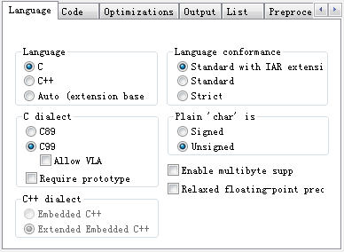
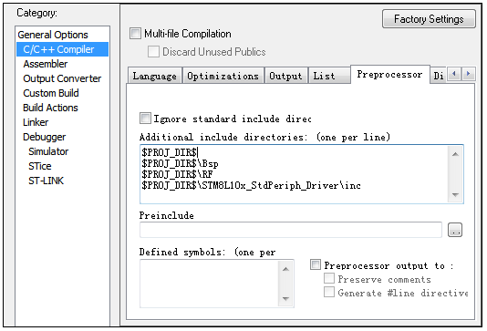

### IAR的有用的快捷键

&emsp;&emsp;`IAR`常用的快捷键如下：<!--more-->

- 显示行号：在代码段点击右键，找到`Options -> Editor`，将右面的`Show Line Numbers`勾选上。
- 注释：`Ctrl + K`；取消注释：`Ctrl + Shfit + K`。
- 自动缩进：选中某些行，然后使用`Ctrl + Shift + I`，可以实现自动缩进。
- 自动往后：选中某些行，然后使用`TAB`键，可以实现自动后退。

### function has no prototype

&emsp;&emsp;有时在`zigbee`协议栈代码中增加自己的代码时，`IAR`编译器会报告出`function has no prototype`的错误。解决方法：进入`options -> C/C++ Compiler -> Language`选项中，去掉`Require prototype`选项：



### Error Pe007: unrecognize token

&emsp;&emsp;一般情况下是英文符号写成了中文符号，例如`;`写成了`；`。

### Segment BANKED\_CODE must be defined in a segment definition option (\-Z, \-b or \-P)

&emsp;&emsp;原因是`IAR`新版本使用旧版本的工程(芯片为`CC2530F256`)。解决方法：打开`project -> options -> linker -> config -> override default`，选择文件`C:\Program Files (x86)\IAR Systems\Embedded Workbench 6.0 Evaluation\8051\config\devices\Texas Instruments\lnk51ew_cc2530F256_banked.xcl`，选择`banked`的`xcl`文件即可。

### Unable to open file lnk51ew_cc2530b.xcl

&emsp;&emsp;在做`light_switch`实验时，遇到问题这样的问题：`Error[e12]: Unable to open file 'lnk51ew_cc2530b.xcl'`。下面是`TI`官网给的解决方案：Linker missing the right path to linker configuration file. In `IAR` open project options (`Alt + F7`), then go to `Linker -> Config`. Under `Linker configuration file` check the override default check box, then click on `...` button and locate the linker configuration file, should be something like that: `...\IAR Systems\Embedded Workbench 6.0\8051\config\devices\Texas Instruments\lnk51ew_cc2530F256.xcl`.

### IAR设置自定义头文件路径

&emsp;&emsp;直接右击`IAR`左侧的`Project`名称，选中`Options`，就出现下面的选项。使用`$PROJ_DIR$`引用环境变量，这个环境变量在`IAR`中被解释为当前工程的绝对路径。然后依次在每一行添加一个目录即可。



&emsp;&emsp;在`options`窗口的`C/C++ compiler`选项和`Assembler`选项里，有个`preprocessor`栏，通常情况下有如下两行：

``` makefile
$TOOLKIT_DIR$\INC\
$TOOLKIT_DIR$\INC\CLIB\
```

以上两行的`$TOOLKIT_DIR$\`意思是安装目录，表示包含头文件的路径在`IAR`安装路径的`8051`文件夹下，也就是说如果`IAR`安装在`C`盘中，那么它就表示`C:\Program Files\IAR Systems\Embedded Workbench 4.05 Evaluation version\8051`这个路径。
&emsp;&emsp;在`additional include directories:`下面的空白框里填上你的头文件包含目录。为了备份和拷贝方便，最好把工程文件放到项目目录中，设置方法如下：`$PROJ_DIR$\`即你当前工作的`workspace`的目录，`..\`表示对应目录的上一层目录，比如`$PROJ_DIR$\..\inc`表示你的`WORKSPACE`目录上一层的`INC`目录。