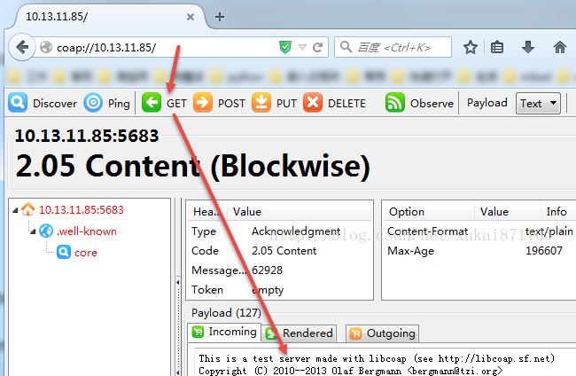

&emsp;&emsp;`libcoap`是`CoAP`协议的`C`语言实现，它提供`server`和`client`功能，是调试`CoAP`的有力工具。通过`git clone`获取最新版本：

``` bash
git clone https://github.com/authmillenon/libcoap.git
```

&emsp;&emsp;由于`libcoap`源码中有`configure.in`文件，需要使用`autoconf`生成`configure`文件：

``` bash
autoconf  # 生成configure文件
./configure  # 生成makefile文件
make  # 编译
sudo make install  # 安装
```

安装完成之后，系统便会新建`/usr/local/include/libcoap`目录，并把`coap.h`、`config.h`、`debug.h`、`pdu.h`等头文件复制到该目录中。另外，编译生成的`libcoap.a`静态链接库被复制到了`/usr/local/lib`中。
&emsp;&emsp;进入`example`文件夹，在该文件夹中还有两个可执行文件，即`coap-client`和`coap-server`。`coap-client`提供非常多的客户端测试指令，而`coap-server`提供一个较为简单的服务器端功能。

### 服务器端测试

&emsp;&emsp;在开始服务器端测试之前，必须知道服务器端的`IP`地址，假设为`10.13.11.85`：

``` bash
./coap-server  # 运行coap-server
```

在`firefox`中运行使用`GET`方法访问该服务器，该步骤需要保证`firefox`已经安装`copper`插件。在浏览器地址栏中输入`coap://10.13.11.85`，点击工具栏中的`GET`按钮，那么`coap-server`便会返回以下内容：



### 客户端测试

&emsp;&emsp;运行`coap-server`和`coap-client`：

``` bash
./coap-server  # 运行coap-server
./coap-client -m get -o result.txt coap://localhost  # 运行coap-client
```

`-m`表示`coap`访问方法，此处设置为`get`方法。除了`get`方法，还包括`put`、`post`和`delete`。`-o`表示访问获得的内容保存到`result.txt`文件中。
&emsp;&emsp;如果访问成功，那么控制台输出`v:1 t:0 tkl:0 c:1 id:45104`。`v`表示`coap`的版本编号，此时的`coap`版本编号为`1`；`t`表示报文类型为`CON`；`tkl`表示`token`区域的长度，此时的`token`区域的长度为`0`；`c`表示访问方法；`id`表示`message id`。`result.txt`文件内容为：

``` bash
This is a test server made with libcoap (see http://libcoap.sf.net)
Copyright (C) 2010--2013 Olaf Bergmann <bergmann@tzi.org>
```

&emsp;&emsp;**补充说明**：
&emsp;&emsp;1. `Ubuntu`安装`autoconf`需要使用命令`sudo apt-get install autoconf`。
&emsp;&emsp;2. `libcoap`的`post`使用方法如下(`-e`指定`post`方法的负载)：

``` bash
./coap-client coap://ip地址/test/led -m post -e "&color=r&mode=on"
```

&emsp;&emsp;3. 对于`IPv6`地址，要使用方括号括起来，例如`coap://[aaaa::212:4b00:102a:a556]/test/hello`。