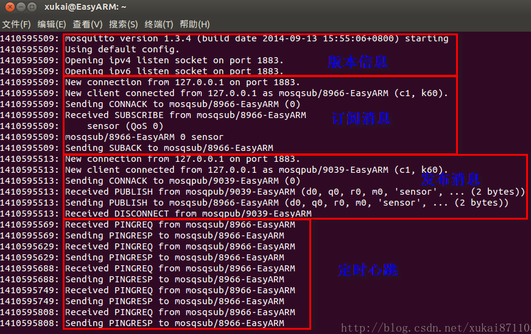

### 前言

&emsp;&emsp;`MQTT`是`IBM`开发的一个即时通讯协议。`MQTT`是面向`M2M`和物联网的连接协议，采用轻量级发布和订阅消息传输机制。`Mosquitto`是一款实现了`MQTT v3.1`协议的开源消息代理软件，提供轻量级的、支持`发布/订阅`的消息推送模式，使设备对设备之间的短消息通信简单易用。若初次接触`MQTT`协议，可先理解以下概念：

- `MQTT`协议特点：相比于`RESTful`架构的物联网系统，`MQTT`协议借助消息推送功能，可以更好地实现远程控制。
- `MQTT`协议角色：在`RESTful`架构的物联网系统，包含两个角色客户端和服务器端，而在`MQTT`协议中包括发布者、代理器(服务器)和订阅者。
- `MQTT`协议消息：`MQTT`中的消息可理解为发布者和订阅者交换的内容(负载)，这些消息包含具体的内容，可以被订阅者使用。
- `MQTT`协议主题：`MQTT`中的主题可理解为相同类型或相似类型的消息集合。

### 安装和使用注意点

&emsp;&emsp;安装步骤如下：

``` bash
wget http://mosquitto.org/files/source/mosquitto-1.4.5.tar.gz
tar zxfv mosquitto-1.4.5.tar.gz
cd mosquitto-1.4.5
make
sudo make install
```

安装时，需要注意如下几点：

- 编译找不到`openssl/ssl.h`，解决方法为`sudo apt-get install libssl-dev`。
- 编译过程找不到`ares.h`，解决方法为`sudo apt-get install libc-ares-dev`。
- 编译过程找不到`uuid/uuid.h`，解决方法为`sudo apt-get install uuid-dev`。
- 使用过程中找不到`libmosquitto.so.1`，解决方法为：

``` bash
sudo ln -s /usr/local/lib/libmosquitto.so.1 /usr/lib/libmosquitto.so.1
sudo ldconfig
```

### 简单测试

&emsp;&emsp;一个完整的`MQTT`示例包括一个代理器，一个发布者和一个订阅者。测试分为以下几个步骤：

1. 启动服务`mosquitto`。
2. 订阅者通过`mosquitto_sub`订阅指定主题的消息。
3. 发布者通过`mosquitto_pub`发布指定主题的消息。
4. 代理服务器把该主题的消息推送到订阅者。

&emsp;&emsp;在本例中，发布者、代理和订阅者均为`localhsot`，但是在实际的情况下三种并不是同一个设备。在`mosquitto`中可通过`-h`(或`--host`)设置主机名称(`hostname`)。为了实现这个简单的测试案例，需要在`linux`中打开三个控制台，分别代表代理服务器、发布者和订阅者：


- 启动代理服务，命令为`mosquitto -v`，`-v`是为了打印更多的调试信息。
- 订阅主题，命令为`mosquitto_sub -v -t sensor`，`-t`指定主题，此处为`sensor`。
- 发布内容，命令为`mosquitto_pub -t sensor -m 12`，`-t`指定主题，`-m`指定消息内容。

&emsp;&emsp;当发布者推送消息之后，订阅者获得内容`sensor 12`。而代理服务器控制台中会出现一一连接、消息发布和心跳等调试信息。通过代理服务器的调试输出，可以对`MQTT`协议的相关过程有所了解：



&emsp;&emsp;**补充说明**：在启动`MQTT`服务器后，应该先进行消息订阅，再进行消息发布，否则订阅者收不到发布者发布的消息。