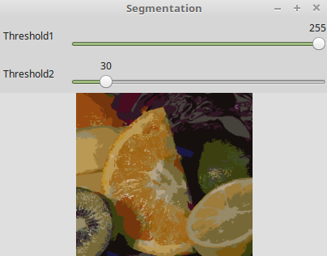

### Linux下的安装(2.4.9版)

&emsp;&emsp;1. 安装`cmake`以及一些依赖库：

``` bash
sudo apt-get install cmake
sudo apt-get install build-essential libgtk2.0-dev libavcodec-dev libavformat-dev
sudo apt-get install libjpeg.dev libtiff4.dev libswscale-dev libjasper-dev
```

&emsp;&emsp;2. 从官网下载`opencv`源代码，随后进行如下操作：

``` bash
unzip OpenCV-2.4.9.zip
cd opencv-2.4.9
mkdir build
cd build
cmake ..
sudo make -j4
sudo make install
```

&emsp;&emsp;3. 将`opencv`库路径加入到系统中：

``` bash
sudo vim /etc/ld.so.conf.d/opencv.conf
```

在其末尾加入`/usr/local/lib`，保存并退出，随后使配置生效：

``` bash
sudo ldconfig  # 使配置生效
```

打开文件`/etc/bash.bashrc`，并在文件末尾加入：

``` bash
PKG_CONFIG_PATH=$PKG_CONFIG_PATH:/usr/local/lib/pkgconfig
export PKG_CONFIG_PATH
```

最后使配置生效：

``` bash
source /etc/bash.bashrc  # 使配置生效
sudo updatedb  # 更新database
```

&emsp;&emsp;4. 测试：进入目录`opencv-2.4.9/samples/c`，运行`build_all.sh`脚本：

``` bash
./build_all.sh
```

使用下面的一个`sample`进行测试：

``` cpp
./pyramid_segmentation
```



&emsp;&emsp;**补充说明**：
&emsp;&emsp;1. 一定不要忘记安装`g++`编译器。
&emsp;&emsp;2. 最好不要在`samba`服务器的目录下编译`opencv`。

---

### Windows下的安装(2.4.13版本)

&emsp;&emsp;在官网(`http://opencv.org/`)上找到`OpenCV`的`Windows`版，并下载下来。双击该文件后会提示解压到某个地方：


&emsp;&emsp;在解压目录下会有`build`和`source`两个文件夹，`build`下是使用`OpenCV`相关的文件，`sources`下是`OpenCV`的源代码。
&emsp;&emsp;接下来添加环境变量。如果是`64`位系统，将文件夹下的`opencv\build\x64\vc14\bin`目录添加到系统变量`Path`中；如果是`32`位系统，则将`opencv\build\x86\vc14\bin`目录添加到环境变量。

#### 工程包含(include)目录的配置

&emsp;&emsp;使用`visual studio`新建一个`hello world`工程，然后点击`View -> Other Windows -> Property Manager`进行配置：


&emsp;&emsp;如果想采用`Debug`模式编译代码，则双击`Debug|64`，出现如下界面：


&emsp;&emsp;在`通用属性 -> VC++目录 -> 包含目录`中添加如下目录：

``` cpp
D:\Program Files\opencv\build\include
D:\Program Files\opencv\build\include\opencv
D:\Program Files\opencv\build\include\opencv2
```

#### 工程库(lib)目录的配置

&emsp;&emsp;在`通用属性 -> VC++目录 -> 库目录`中添加如下目录：

``` cpp
D:\Program Files\opencv\build\x64\vc14\lib
```

#### 链接库的配置

&emsp;&emsp;在`通用属性 -> 链接器 -> 输入 -> 附加的依赖项`中输入如下内容：

``` cpp
opencv_calib3d2413d.lib
opencv_contrib2413d.lib
opencv_core2413d.lib
opencv_features2d2413d.lib
opencv_flann2413d.lib
opencv_gpu2413d.lib
opencv_highgui2413d.lib
opencv_imgproc2413d.lib
opencv_legacy2413d.lib
opencv_ml2413d.lib
opencv_nonfree2413d.lib
opencv_objdetect2413d.lib
opencv_ocl2413d.lib
opencv_photo2413d.lib
opencv_stitching2413d.lib
opencv_superres2413d.lib
opencv_ts2413d.lib
opencv_video2413d.lib
opencv_videostab2413d.lib
```

需要注意的是，所粘贴内容即为之前解压的`OpencV`目录`D:\opencv\build\x64\vc14\lib`下所有`lib`库文件的名字，其中的`2413`代表`OpenCV`版本为`2.4.13`。`Debug`文件库名有`d`结尾，`Release`则没有，例如`opencv_ts2413d.lib`是`debug`版本，`opencv_ts248.lib`是`release`版本。
&emsp;&emsp;最后使用如下代码进行测试：

``` cpp
#include <iostream>
#include <opencv2/core/core.hpp>
#include <opencv2/highgui/highgui.hpp>
​
using namespace cv;
​
int main() {
    Mat img = imread("empire.jpg");
    imshow("Picture", img);
    waitKey(6000);
}
```