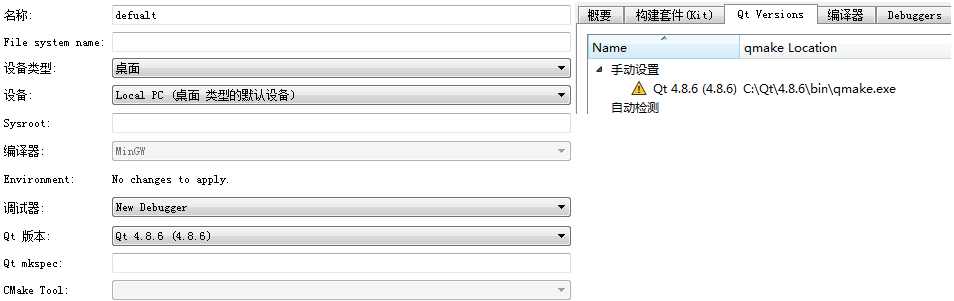

### Windows安装Qt

&emsp;&emsp;`Qt`一直以来分为商业、开源两个版本。商业版本为用户提供了二级制的动态库，直接安装既可以使用，但是需要花钱购买`license`；开源版本则遵守`GPL`协议，提供了源码，用户需要自行编译才能生产动态库文件。
&emsp;&emsp;`Qt`开发首先要安装`Qt library`和`Qt Creator`。`Qt library`为`Qt`程序提供头文件、静态链接库和动态链接库；`Qt Creator`则是用于编程的`IDE`，提供了`GUI`界面绘制、代码编写、程序调试等多个功能。`Qt`的官方下载网址为`http://qt-project.org/downloads`。
&emsp;&emsp;`Qt Library`有很多版本，在`Windows`下可以选择的就有`MinGW`、`VS2008`、`VS2010`、`VS2012`。这些版本的主要是编译器的不同，因为`Qt Library`还需要我们自己编译才可以使用，所以你要决定好用什么编译器，然后在选择那个版本。
&emsp;&emsp;选择好了`Qt Library`之后，在安装之前确认做好了足够的准备。如果你下载的是`MinGW`版本的，那么请安装`MinGW`之后再安装`Qt Library`。安装过程中会提示你选择`MinGW`的安装目录。
&emsp;&emsp;以下介绍`MinGW`版本的安装：
&emsp;&emsp;1. 安装`MinGW`：下载地址是`http://mingwbuilds.sourceforge.net/`，将解压之后的文件放在`C`盘根目录下(其他盘也可以，但是在安装`Qt Library`时记得选择路径)。
&emsp;&emsp;2. 安装`Qt Library`：开始安装`Qt Library`，按照提示安装下去。中间选择`MinGW`安装目录，选择刚才你安装的地方，一般为`C:\mingw`，最后提示安装完成。这里下载的是开源版本，实际上就是`Qt library`的源代码和一些静态库。还需要对其进行编译，方法是`开始菜单 -> 程序 -> Qt by Digia v4.8.5 (MinGW OpenSource) -> Qt 4.8.5 (Build Debug Libraries)`，会出现命令行窗口，接下来需要做的就是编译`Library`。命令行只有两次交互，第一次是让你选择开源版本`o`，还是商业版本`c`，键盘点击`o`；第二次是提示你是否同意条款，键盘点击`y`。接下来就是漫长的编译过程。
&emsp;&emsp;全部安装完成之后，如果想在`Qt creator`中使用`Qt`的`sdk`，还需要进行一些设置。打开`creator`，菜单栏中的`工具 -> 选项`，在左侧中选择`构建和调试`，在`compiler`、`Qt版本`选项卡中，选择`MinGW`的`g++.exe`的路径(通常是在`mingw`目录下的`bin`中)，选择`Qt`的`qmake`路径以及版本号(`qmake`通常是`Qt\4.8.4\bin\qmake.exe`)。最后选择`Kit`选项卡，单击`add`按钮创建一个新的编译设置项，按照提示选择编译器、`Debuger`(通常是`mingw`目录的`bin\gdb.exe`)、`Qt`版本号。



---

### 树莓派安装Qt

#### apt-get

&emsp;&emsp;Firstly I got the development tools needed by `Qt Creator` in the hope it would be less heavy for the `Pi` to download separately.

``` bash
sudo apt-get install qt4-dev-tools
```

Then I went for `Qt Creator`:

``` bash
sudo apt-get install qtcreator
```

I also installed:

``` bash
sudo apt-get install gcc
sudo apt-get install xterm
sudo apt-get install git-core
sudo apt-get install subversion
```

#### Problem: no toolchain

&emsp;&emsp;We can only compile for remote embedded devices and this is not the case here, because we are on the `Pi` and not remotely accessing it.
&emsp;&emsp;I added a gcc toolchain: `Tools/Options` > `build & run` > `tab tool chains` > `button add`, choose `GCC`, then set:

- `compiler path`: `/usr/bin/arm-linux-gnueabihf-gcc-4.6`
- `Debugger`: `/usr/bin/gdb`
- `Mkspec`: `default`