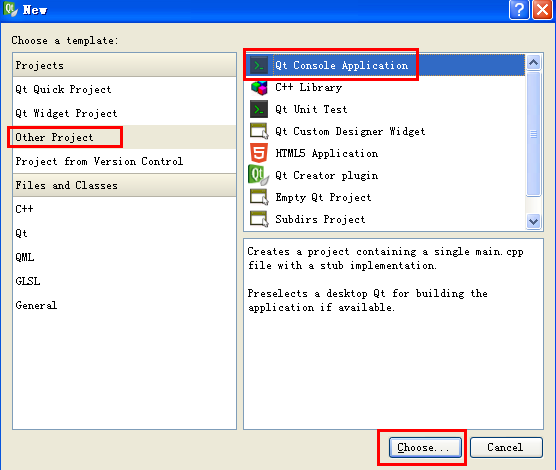

### undefined reference to vtable

&emsp;&emsp;问题描述：在某一个类中，如果加入`Q_OBJECT`，则`link`时会提示`undefined reference to vtable for "xxx::xxx"`。可是删掉`Q_OBJECT`，再编译程序时，`Qt`的应用程序输出中又会显示`Object::connect: No such slot XXX::XXX()`。
&emsp;&emsp;原因：删除`Q_OBJECT`之后，该类的信号槽机制就失效了，因此在其他类中`connect`该类的槽时，就会显示`No such slot...`。在该类中加上`Q_OBJECT`之后，`link`提示`undefined reference to vtable for "xxx::xxx"`。如果不是语法错误，那么可能的原因是该类原来没有添加`Q_OBJECT`，则在程序输出目录中，由`qmake`生成的`makefile`文件里不存在编译`Q_OBJECT`的信息，因此信号槽机制失效。而在该类加上`Q_OBJECT`后，`Qt Creator`没有自动执行`qmake`来更新`makefile`文件，这就会在`link`时有上述错误。
&emsp;&emsp;解决办法：删除程序的输出目录`build-XXX-XXX-release`，重新构建项目就行了。

### gcc warning will be initialized after [\-Wreorder]

&emsp;&emsp;构造函数时，初始化成员变量的顺序要与类声明中的变量顺序相对应。若不对应，则出现题目中的错误。解决方法就是按照顺序进行初始化。对于这个问题，`StackOverflow`上也发生了讨论，以下摘录原文：
&emsp;&emsp;Question: I am getting a lot of these warnings from `3rd` party code that I cannot modify. Is there a way to disable this warning or at least disable it for certain areas (like `#pragma push/pop` in `VC++`)?

``` cpp
list.h:1122: warning: `list<LogOutput*, allocator<LogOutput*> >::node_alloc_' will be initialized after
list.h:1117: warning: `allocator<LogOutput*> list<LogOutput*, allocator<LogOutput*> >::alloc_'
```

&emsp;&emsp;Best Answer：Make sure the members appear in the initializer list in the same order as they appear in the class:

``` cpp
Class C {
    int a;
    int b;
    C() : b ( 1 ), a ( 2 ) {} /* warning, should be "C(): a(2), b(1)" */
}
```

### Qt Creator开启C++11选项

&emsp;&emsp;想要支持`C++11`的话，`GCC`的版本不能太低。具体方法：在`.pro`文件中加入下面这一句话：

``` makefile
QMAKE_CXXFLAGS += -std=c++0x  # 对于Qt4.7版本
CONFIG += c++11  # 对于Qt5版本
```

### Qt Creator快捷操作

- 按`F2`快速切换到光标选中对象的源码。
- `Ctrl + /`注释或取消注释选定内容。

### Qt Creator控制台方式输出

&emsp;&emsp;新建`Qt Console Application`项目：



输入以下代码：

``` cpp
#include <QtCore/QCoreApplication>
#include <stdio.h>

int main ( int argc, char * argv[] ) {
    QCoreApplication a ( argc, argv );
    printf ( "Hello World" );
    return a.exec();
}
```

### Object::connect: No such slot

&emsp;&emsp;编译代码时，发现`make`的时候提示：

``` bash
Object::connect: No such slot FindDialog::enbleFindButton(const QString &) no such slot
```

根据网上资料，首先查看类声明中有没有`Q_OBJECT`，其次需要为新增的函数添加声明：

``` cpp
private slots:
    void xxxx();
```

同时不要忘记检查`slot`函数是否出现了拼写错误，如果有，可能也会出现上述问题。

### QFtp: No such file or directory

&emsp;&emsp;在项目的`.pro`文件中加入如下代码：

``` makefile
QT += network
```